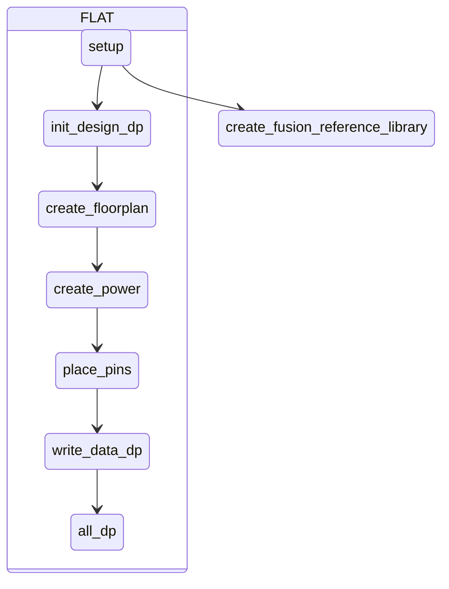
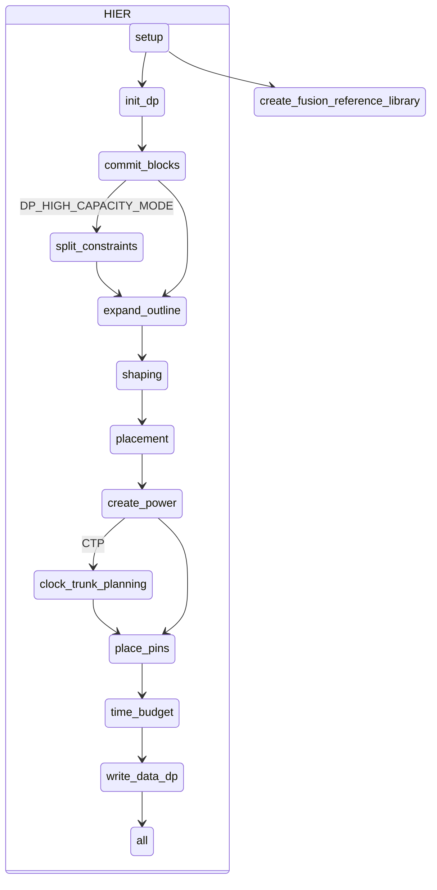
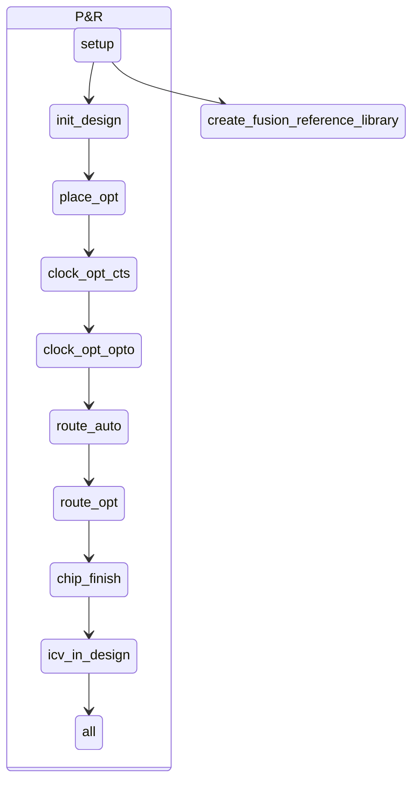

# 如何取得 Reference Methodology

 - 前往 Synopsys SolvNet [Methodology](https://solvnet.synopsys.com/rmgen) 下載，需有驗證帳號方可下載。
 
 - 或者執行 **icc2_shell -gui** 開啟圖形介面，點選

執行路徑底下會有 ICC2-RM_*.tar.gz，請輸入以下指令解壓縮。

    tar zxvf *.tar.gz

# 如何建立架構

先建立 **design.cfg** 檔案，根據需求去調整檔案內容。

FLAT 架構填入

	TOP_module_name

HIER 架構填入多層名稱，只能使用 TAB 或 SPACE 鍵。

	TOP_module_name
		MID_module_name
			BOT_module_name

設定完 **design.cfg** 檔案後，執行以下命令。其中 **$projdir** 請替換成工作目錄位置。

    unpack_rm_dir.pl design.cfg $projdir

執行完後目錄架構應該如下

	$projdir
		ICC2_RM_*
		dp
			TOP_module_name
		pnr
			TOP_module_name
			MID_module_name
			BOT_module_name

# Makefile_* 設定

切到 **$projdir/dp/TOP_module_name** 底下，編輯 Makefile

	ICC2_EXEC = icc2_shell_2023
	FM_EXEC = fm_shell_2023
	VC_LP_EXEC = vc_static_shell_2023
	OPTIONS =-f ./set_options.tcl

新增 **set_options.tcl** 檔案，內容為

	set_host_options -max_cores 8
	set_app_options -name shell.common.tmp_dir_path -value /export/home/pdsapr
	gui_create_pref_key -category {layout} -key {layoutToolbarAutoApply} -value_type {bool} -value {true}

新增 **run_icc2** 檔案，內容為

	rm -rf ~/.synopsys_icc2_gui
	icc2_shell_2023 -gui -f ./set_option.tcl -output_log_file logs_icc2/icc2.log.`date "+%m_%d_%H_%M"`
   
# rm_setup 資料夾設定

首先切到 **$projdir/dp/TOP_module_name/rm_utilities** 底下，輸入 rm_setup 資料夾底下想設定的檔案

	configureRM --in $projdir/dp/TOP_module_name/rm_setup/design_setup.tcl

需要設定下列這些檔案

	design_setup.tcl
	sidefile_setup.tcl
	icc2_dp_setup.tcl
	icc2_pnr_setup.tcl

# FLAT Design Planning 流程圖

# HIER Design Planning 流程圖

# Block-level Implementation 流程圖

