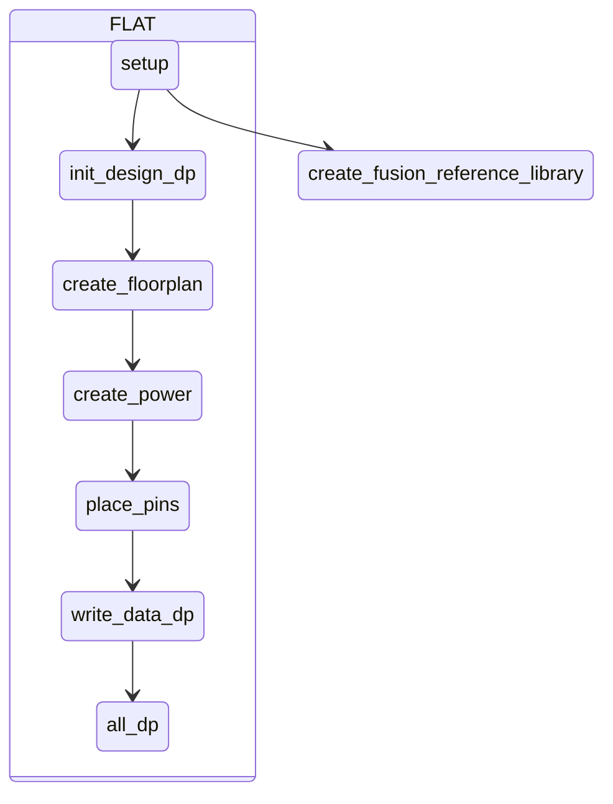
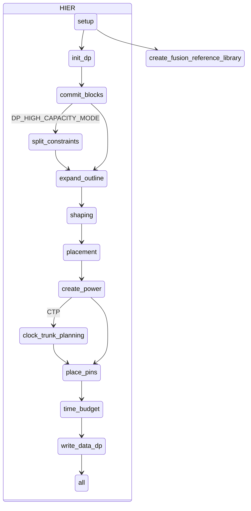
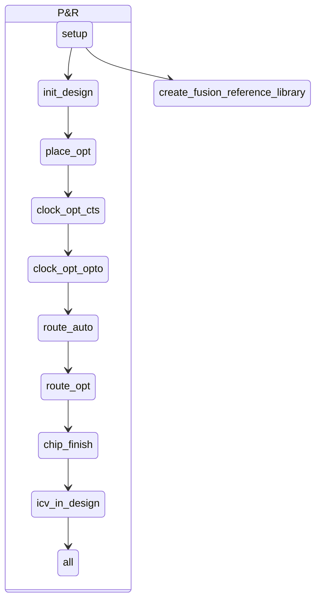

# 如何取得 Reference Methodology

 - 前往 Synopsys SolvNet [Methodology](https://solvnet.synopsys.com/rmgen) 下載，需有驗證帳號方可下載。
 
 - 或者執行 **icc2_shell -gui** 開啟圖形介面，點選

執行路徑底下會有 ICC2-RM_*.tar.gz，請輸入以下指令解壓縮。

    tar zxvf *.tar.gz

# 如何建立架構

先建立 **design.cfg** 檔案，根據需求去調整檔案內容。

FLAT 架構填入

	TOP_module_name

HIER 架構填入多層名稱，只能使用 TAB 或 SPACE 鍵。

	TOP_module_name
		MID_module_name
			BOT_module_name

設定完 **design.cfg** 檔案後，執行以下命令。其中 **$projdir** 請替換成工作目錄位置。

    unpack_rm_dir.pl design.cfg $projdir

執行完後目錄架構應該如下

	$projdir
		ICC2_RM_*
		dp
			TOP_module_name
		pnr
			TOP_module_name
			MID_module_name
			BOT_module_name

# Makefile_* 設定

切到 **$projdir/dp/TOP_module_name** 底下，編輯 Makefile

	ICC2_EXEC = icc2_shell_2023
	FM_EXEC = fm_shell_2023
	VC_LP_EXEC = vc_static_shell_2023
	OPTIONS =-f ./set_options.tcl

新增 **set_options.tcl** 檔案，內容為

	set_host_options -max_cores 8
	set_app_options -name shell.common.tmp_dir_path -value /export/home/pdsapr
	gui_create_pref_key -category {layout} -key {layoutToolbarAutoApply} -value_type {bool} -value {true}

新增 **run_icc2** 檔案，內容為

	rm -rf ~/.synopsys_icc2_gui
	icc2_shell_2023 -gui -f ./set_option.tcl -output_log_file logs_icc2/icc2.log.`date "+%m_%d_%H_%M"`
   
# rm_setup 資料夾設定

首先切到 **$projdir/dp/TOP_module_name/rm_utilities** 底下，輸入 rm_setup 資料夾底下想設定的檔案

	configureRM --in $projdir/dp/TOP_module_name/rm_setup/design_setup.tcl

需要設定下列這些檔案項目

## design_setup.tcl

### GENERAL
	set DESIGN_NAME "module_name"

### DESIGN PLANNING SETUP
	set DESIGN_STYLE "flat" ;# 只有在 hier PNR 流程才需要改成 hier
	set PHYSICAL_HIERARCHY_LEVEL "bottom" ;# 只有在 hier PNR 流程才需要改成 top|intermediate|bottom;

### LIBRARY SETUP
	set REFERENCE_LIBRARY "" ;# 填入NDM 所在位置 STD_NDM 要在最前面
	set TCL_MULTI_VT_CONSTRAINT_FILE "multi_vth_constraint_script.tcl" ;# A Tcl file which defines and applies multi Vt constraints
	set TCL_LIB_CELL_PURPOSE_FILE "set_lib_cell_purpose.tcl" ;# A Tcl file which applies lib cell purpose related restrictions;
	set TIE_LIB_CELL_PATTERN_LIST "*/*TIE*" ;# TIE CELL 名稱
	set HOLD_FIX_LIB_CELL_PATTERN_LIST ""*/NBUF* */AOBUF* */AOINV* */SDFF*" ;# include repeaters, always-on repeaters and gates always-on buffers
	set CTS_LIB_CELL_PATTERN_LIST "CKBUF CKINV" ;# buffers and inverters

### TECHNOLOGY
	set TECH_FILE "../tech/"
	set TCL_TECH_SETUP_FILE "init_design.tech_setup.tcl"
	set ENABLE_REDUNDANT_VIA_INSERTION true;
	set ENABLE_POST_ROUTE_OPT_REDUNDANT_VIA_INSERTION true;
	set TCL_ANTENNA_RULE_FILE "../tech/"

### MCMM SCENARIO/MODE/CORNER SETUP 
	set TCL_MCMM_SETUP_FILE "init_design.memm_setup.tcl"
	set TCL_PARASITIC_SETUP_FILE "init_design.parasitic_setup.tcl"

## Variables for scenario activation and focused scenario
	set PLACE_OPT_ACTIVE_SCENARIO_LIST ""
	set CLOCK_OPT_CTS_ACTIVE_SCENARIO_LIST ""
	set ROUTE_OPT_ACTIVE_SCENARIO_LIST ""

### LOGICAL INPUTS
	set VERILOG_NETLIST_FILES "design/*.vo"
	set UPF_FILE "design/*.upf"

### PHYSICAL INPUTS
	set TCL_FLOORPLAN_FILE "floorplan/floorplan.tcl"
	set DEF_SCAN_FILE "*design/*.def"

## sidefile_setup.tcl

### Node specific variables
	set ROUTING_LAYER_DIRECTION_OFFSET_LIST "{ME1 horizontal} {ME2 vertical}"
	set MIN_ROUTING_LAYER "ME1"
	set MAX_ROUTING_LAYER "ME5"
	set TCL_USER_CONNECT_PG_NET_SCRIPT "user_connect_pg_net.tcl"
	set TCL_COMPILE_PG_FILE "compile_pg.tcl"
	set TCL_LIB_CELL_DONT_USE_FILE "design/dont_use.tcl"
	set TCL_LIB_CELL_DONT_TOUCH_FILE "design/dont_touch.tcl"
	set TCL_CTS_NDR_RULE_FILE "cts_ndr.tcl"
	set CHIP_FINISH_METAL_FILLER_LIB_CELL_LIST "C"
	set CHIP_FINISH_NON_METAL_FILLER_LIB_CELL_LIST "NO_C"
	set WRITE_GDS_LAYER_MAP_FILE "streamout.map.icc2"

## icc2_dp_setup.tcl

### Flow setup applicable to both flat and hierarchical DP flows
	set DP_FLOW "flat"
	set TCL_FLOORPLAN_FILE_DP "floorplan/floorplan.tcl"
### Hierarchical Design Planning Setup
	set DP_HIGH_CAPACITY_MODE "false"
	set FLOORPLAN_STYLE "abutted"
	set DISTRIBUTED "false"
### If the design is run with MIBs then change the block list appropriately
	set SUB_BLOCK_REFS ""
### TOP LEVEL FLOORPLAN CREATION (die, pad, RDL) / PLACE IO
	set TCL_USER_INIT_DP_PRE_SCRIPT "init_dp_pre_script.tcl"
### SHAPING
	set TCL_SHAPING_CONSTRAINTS_FILE "shaping_constraints.tcl"
### PLACEMENT
	set TCL_AUTO_PLACEMENT_CONSTRAINTS_FILE "auto_placement_constraints.tcl"
	set CONGESTION_DRIVEN_PLACEMENT "macro"
	set TIMING_DRIVEN_PLACEMENT "std_cell"
	set MACRO_CONSTRAINT_STYLE "edge"
### PNS
	set TCL_PNS_FILE "pns_strategies.tcl"
	set PNS_CHARACTERIZE_FLOW "false"
	set TCL_COMPILE_PG_FILE "此設定會被 sidefile_setup.tcl 內容覆蓋"
### PLACE PINS
	set TCL_PIN_CONSTRAINT_FILE "pins_constraints.tcl"
## icc2_pnr_setup.tcl
	目前無需修改

# FLAT Design Planning 流程圖

# HIER Design Planning 流程圖

# Block-level Implementation 流程圖

