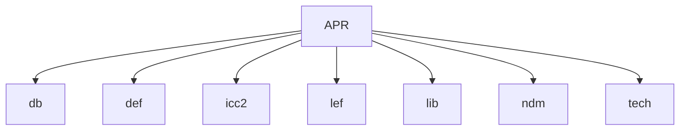
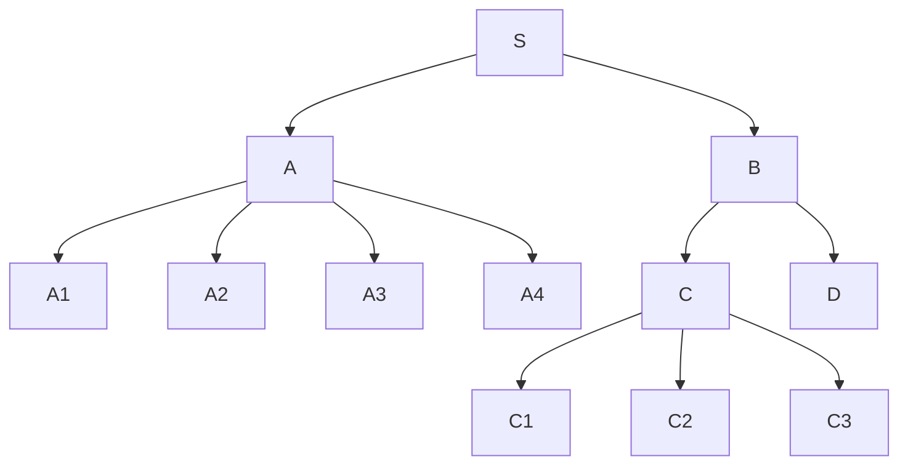
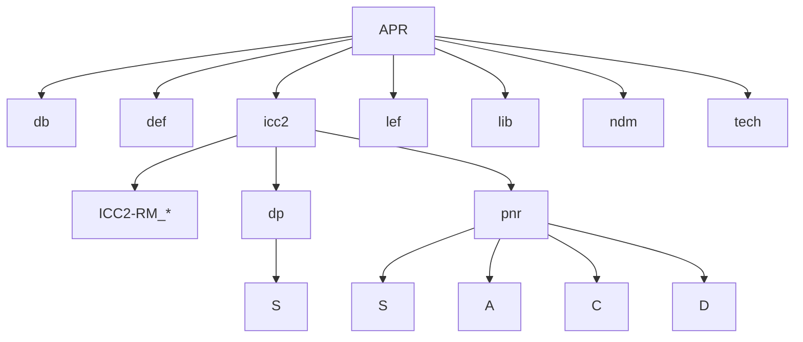
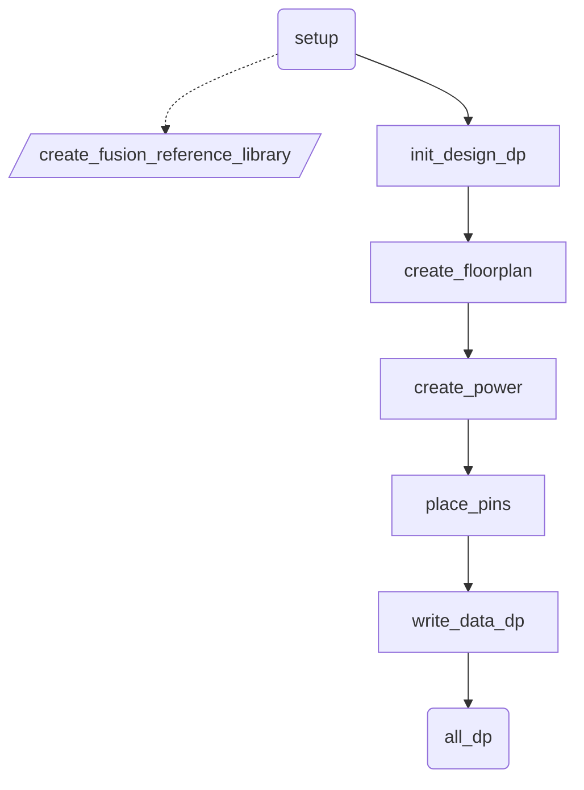
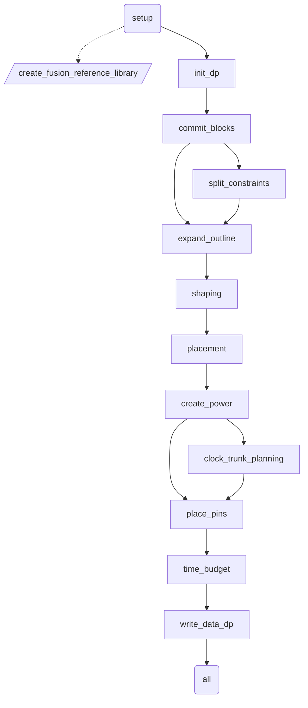
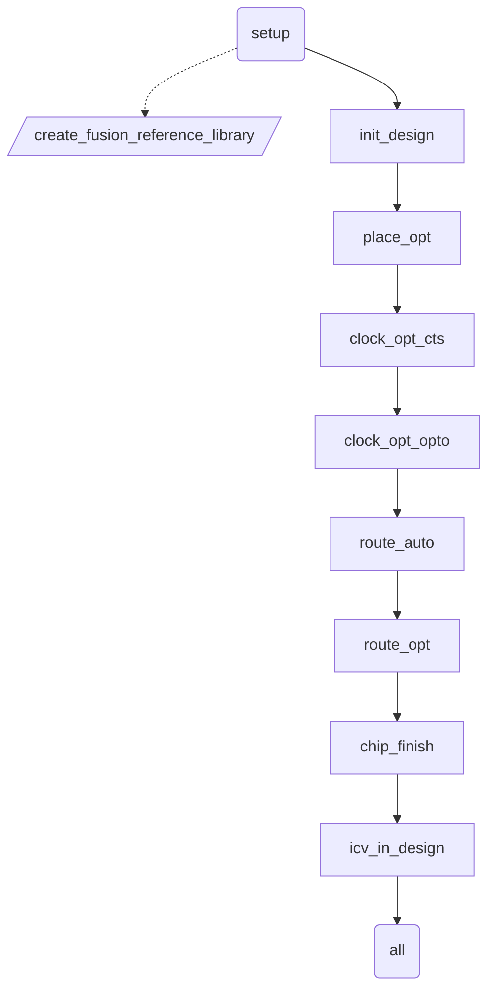

# IC Compiler II Reference Methodology

## 目錄結構設定



如何取得 Reference Methodology?前往 [https://solvnet.synopsys.com/rmgen](https://solvnet.synopsys.com/rmgen) 下載，需有企業驗證帳號。或者在 icc2 目錄下啟動圖形介面，點選


當前路徑底下會有 **ICC2-RM_*.tar.gz** 輸入下列指令解壓縮。

```bash
    tar zxvf *.gz
```

解壓縮完畢後進入資料夾內先建立 **design.cfg** 檔案，根據需求去調整檔案內容。假設電路邏輯架構如下圖



內容只填寫 TOP 名稱那就是走 FLAT 架構；填入多層名稱就是走 HIER 架構(使用 space 或 tab 換行分層)

tab 純 BOT 切法表示：

```text
S
    A
    C
    D
```

tab 多切一層 MID 切法表示：

```text
S
    A
    B
        C
        D
```

設定完 **design.cfg** 檔案後，執行以下命令會開始拷貝並建立工作環境，其中 **APR/icc2** 請替換成實際工作目錄位置。建議先完善所有基本設定，避免需要重複編輯設定檔案。

```bash
    unpack_rm_dir.pl design.cfg APR/icc2
```

執行完後目錄架構應該如下



完成後請先到 **APR/icc2/ICC2-RM_*** 底下。建立 rm_tech_scripts 捷徑指到 TECH 資料夾。

```bash
 ln -s ../tech rm_tech_scripts
```

## rm_setup 資料夾設定

rm_utilities 資料夾內附圖形化設定介面 configureRM
查看支援檔案請輸入

```bash
 configureRM --sf
```

編輯檔案請輸入

```bash
 configureRM --in ../rm_setup/design_setup.tcl
```

需要修改下列檔案

- [Makefile_*](#makefile_)
- [design_setup.tcl](#design_setuptcl)
- [header_icc2_*.tcl](#header_icc2_tcl)
- [icc2_dp_setup.tcl](#icc2_dp_setuptcl)
- [sidefile_setup.tcl](#sidefile_setuptcl)

### Makefile_*

根據啟動環境編輯 Makefile 內容以符合環境設定，使用 **which** 查詢全路徑後修改

```text
 ICC2_EXEC = icc2_shell
 FM_EXEC = fm_shell
 VC_LP_EXEC = vc_static_shell
```

### design_setup.tcl

| 項目 | 變數 | 數值 | 說明 |
| --- | --- | --- | --- |
| GENERAL | DESIGN_NAME | module_name | unpack_rm_dir.pl 根據 design.cfg 自動填入 module 名稱 |
| DESIGN PLANNING SETUP | DESIGN_STYLE | flat | unpack_rm_dir.pl 在 HIER 流程自動修改成 hier |
| DESIGN PLANNING SETUP | PHYSICAL_HIERARCHY_LEVEL | bottom | unpack_rm_dir.pl 在 HIER 流程自動改成 top 、 intermediate 、 bottom |
| DESIGN PLANNING SETUP | SUB_BLOCK_LIBRARIES | 填寫 block 全路徑 | 在 PNR 階段需要填寫完成的 block 資料夾所在位置 |
| LIBRARY SETUP | REFERENCE_LIBRARY | *.ndm | 填入NDM 所在位置 STD_NDM 要在最前面 |
| LIBRARY SETUP | TCL_MULTI_VT_CONSTRAINT_FILE | multi_vth_constraint_script.tcl | 編輯 rm_user_plugin_scripts 裡的檔案，修改 HVT SVT LVT 名稱與 LVT % 數 |
| LIBRARY SETUP | TCL_LIB_CELL_PURPOSE_FILE | set_lib_cell_purpose.tcl |編輯 rm_icc2_pnr_scripts 裡的檔案，拷貝 DONT_USE_FILE 多增加 DONT_TOUCH_FILE |
| LIBRARY SETUP | TIE_LIB_CELL_PATTERN_LIST | */*TIE* |TIE CELL 名稱 |
| LIBRARY SETUP | HOLD_FIX_LIB_CELL_PATTERN_LIST | */BUF* */INV* */DEL* |填入修 Hold time 使用的 cell |
| LIBRARY SETUP | CTS_LIB_CELL_PATTERN_LIST | */NBUF* */AOBUF* */AOINV* */SDFF* |修 CTS 使用，包含repeaters, always-on repeaters, and gates, always-on buffer |
| LIBRARY SETUP | CTS_ONLY_LIB_CELL_PATTERN_LIST | */CKBUF* */CKINV* |填入長 CTS 使用的 cell |
| TECHNOLOGY | TECH_FILE | tech.tf | technology file |
| TECHNOLOGY | ENABLE_REDUNDANT_VIA_INSERTION | true | clock_opt_opto, route_auto, route_opt 塞 double via |
| TECHNOLOGY | ENABLE_POST_ROUTE_OPT_REDUNDANT_VIA_INSERTION | true | hyper_route_opt 塞 double via |
| TECHNOLOGY | TCL_ANTENNA_RULE_FILE | antenna_rule.tcl | 參考 examples/TCL_ANTENNA_RULE_FILE.txt 核對製程廠給的資料格式是否正確 |
| MCMM SCENARIO/MODE/CORNER SETUP |TCL_MCMM_SETUP_FILE | init_design.mcmm_setup.tcl | 參考 examples/TCL_MCMM_SETUP_FILE.*.tcl 新建於 rm_icc2_pnr_scripts 裡 |
| MCMM SCENARIO/MODE/CORNER SETUP |TCL_PARASITIC_SETUP_FILE | init_design.parasitic_setup.tcl | 參考 examples/TCL_PARASITIC_SETUP_FILE.tcl 新建於 rm_icc2_pnr_scripts 裡 |
| MCMM SCENARIO/MODE/CORNER SETUP |PLACE_OPT_ACTIVE_SCENARIO_LIST | SCENARIO 名稱 | 根據 init_design.mcmm_setup.tcl 填入 place_opt 啟用的 SCENARIO 名稱 |
| MCMM SCENARIO/MODE/CORNER SETUP |CLOCK_OPT_CTS_ACTIVE_SCENARIO_LIST | SCENARIO 名稱 | 根據 init_design.mcmm_setup.tcl 填入 clock_opt_cts 啟用的 SCENARIO 名稱 |
| MCMM SCENARIO/MODE/CORNER SETUP |ROUTE_OPT_ACTIVE_SCENARIO_LIST | SCENARIO 名稱 | 根據 init_design.mcmm_setup.tcl 填入 route_opt 啟用的 SCENARIO 名稱 |
| LOGICAL INPUTS | VERILOG_NETLIST_FILES | *.vo | design 給 |
| LOGICAL INPUTS | UPF_FILE | *.upf | design 給 |
| PHYSICAL INPUTS | TCL_FLOORPLAN_FILE | floorplan.tcl | 可讀取 DP 結果，位於 outputs_icc2/*write_floorplan/floorplan.tcl |
| PHYSICAL INPUTS | DEF_SCAN_FILE | *.def | design 給 |

### header_icc2_*.tcl

修改 set search_path 加入自訂額外搜尋路徑，例如：./design ./floorplan

### icc2_dp_setup.tcl

| 項目 | 變數 | 數值 | 說明 |
| --- | --- | --- | --- |
| GENERAL | DP_FLOW | flat | unpack_rm_dir.pl 在 HIER 流程自動修改成 hier |
| GENERAL | TCL_FLOORPLAN_FILE_DP | floorplan.tcl | Design Planning 專用 floorplan 請自行設計 |
| GENERAL | DP_HIGH_CAPACITY_MODE | false | 決定 verilog 讀取使用 design / outline 模式 |
| GENERAL | FLOORPLAN_STYLE | abutted | 管道模式 (channel) 或緊鄰模式 (abutted) |
| GENERAL | DISTRIBUTED | false | 個別 block 不同程序執行 |
| GENERAL | SUB_BLOCK_REFS | 各 HIER module 名稱 | unpack_rm_dir.pl 在 HIER 流程自動修改 |
| GENERAL | TCL_TIMING_RULER_SETUP_FILE | init_design.parasitic_setup.tcl | 設定 tlu+ |
| GENERAL | TCL_USER_INIT_DP_PRE_SCRIPT | init_dp_pre_script.tcl | 設定 plan.outline.dense_module_depth -1 |
| GENERAL | TCL_SHAPING_CONSTRAINTS_FILE | shaping_constraints.tcl | 設定 vlotage area 和 shaping constraints |
| GENERAL | TCL_AUTO_PLACEMENT_CONSTRAINTS_FILE | auto_placement_constraints.tcl | 設定 keepout_margin 和 macro 擺放方向 |
| GENERAL | CONGESTION_DRIVEN_PLACEMENT | macro | 建議設定 |
| GENERAL | TIMING_DRIVEN_PLACEMENT | std_cell | 建議設定 |
| GENERAL | MACRO_CONSTRAINT_STYLE | edge | 建議設定 |
| GENERAL | TCL_PNS_FILE | pns_strategies.tcl | 設定 power 和 ground 佈線範圍與佈線條件 |
| GENERAL | PNS_CHARACTERIZE_FLOW | true | 各 block 重複執行 pns_strategies 內容 |
| GENERAL | PNS_CHARACTERIZE_FLOW | false | 由上層 power 和 ground 佈線推下 block 內 |
| GENERAL | TCL_COMPILE_PG_FILE | compile_pg.tcl | 此處設定無用，被 sidefile_setup.tcl 覆蓋 |
| GENERAL | TCL_PIN_CONSTRAINT_FILE | pins_constraints.tcl | 設定 feedthrough 條件與允許使用的 layer |

### sidefile_setup.tcl

| 項目 | 變數 | 數值 | 說明 |
| --- | --- | --- | --- |
| GENERAL | ROUTING_LAYER_DIRECTION_OFFSET_LIST | {ME1 horizontal} {ME2 vertical} | 修改繞線方向 |
| GENERAL | MIN_ROUTING_LAYER | ME1 | 繞線底層 layer |
| GENERAL | MAX_ROUTING_LAYER  |ME5 | 繞線頂層 layer |
| GENERAL | TCL_USER_CONNECT_PG_NET_SCRIPT | user_connect_pg_net.tcl | 自定義 cell power & ground 連接 |
| GENERAL | TCL_COMPILE_PG_FILE | compile_pg.tcl | 自定義 power & ground 佈線 |
| GENERAL | TCL_LIB_CELL_DONT_USE_FILE | dont_use.tcl | 定義不使用 cell |
| GENERAL | TCL_LIB_CELL_DONT_TOUCH_FILE | dont_touch.tcl | 定義不調整 cell |
| GENERAL | TCL_CTS_NDR_RULE_FILE | cts_ndr.tcl | 複製 examples/cts_ndr.tcl 修改 |
| GENERAL | CHIP_FINISH_METAL_FILLER_LIB_CELL_LIST | */FILE64U*/FILE32U */FILE16U |填入有電容 FILER 名稱由大到小 |
| GENERAL | CHIP_FINISH_NON_METAL_FILLER_LIB_CELL_LIST | */FIL4U*/FIL2U */FIL1U |填入一般 FILER 名稱由大到小 |
| GENERAL | WRITE_GDS_LAYER_MAP_FILE | streamout.map | 轉 GDS 對 layer 用 |

## rm_icc2_pnr_scripts 資料夾設定

需要建立或修改下列檔案

- [cts_ndr.tcl](#cts_ndrtcl)
- [init_design.memm_setup.tcl](#init_design.memm_setuptcl)
- [init_design.parasitic_setup.tcl](#init_design.parasitic_setuptcl)
- [set_lib_cell_purpose.tcl](#set_lib_cell_purposetcl)
- [set_timing_derate.tcl](#set_timing_deratetcl)

### cts_ndr.tcl

 CTS_NDR_RULE_NAME "rm_2w2s"
 CTS_NDR_MIN_ROUTING_LAYER "ME3"
 CTS_NDR_MAX_ROUTING_LAYER "ME5"

## Design Planning 流程圖 (FLAT)



## Design Planning 流程圖 (HIER)



## Block-level Implementation 流程圖


