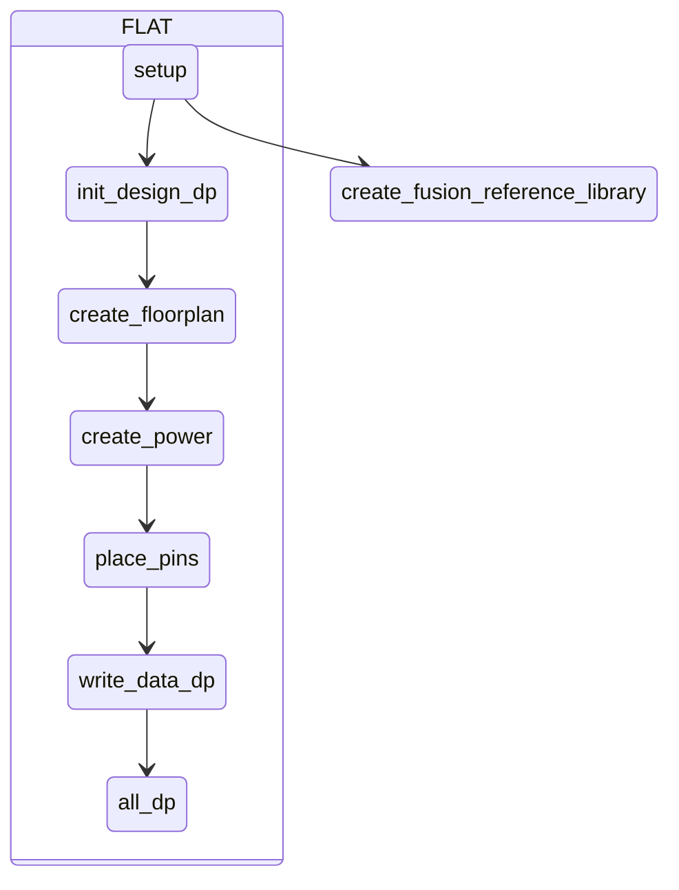
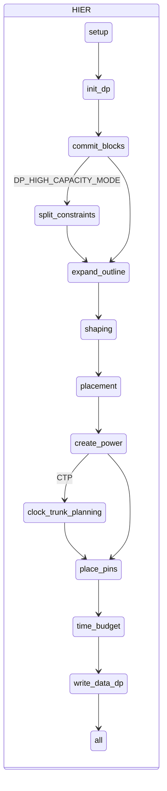

# 如何取得 Reference Methodology

 - 前往 Synopsys SolvNet [Methodology](https://solvnet.synopsys.com/rmgen) 下載，需有驗證帳號方可下載。
 
 - 或者執行 **icc2_shell -gui** 開啟圖形介面，點選
 
   > Help -> Generate RM Scripts -> I agree to the above Terms and Conditions > OK
   
   執行路徑底下會有 ICC2-RM_*.tar.gz，請輸入 `tar zxvf *.tar.gz` 解壓縮。

# 如何建立目錄架構

先建立 **design.cfg** 檔案，根據需求去調整檔案內容。

FLAT 架構填入

	TOP module name

HIER 架構填入多層名稱，只能使用 TAB 或 SPACE 鍵。

	TOP module name
		MID module name
			BOT module name

設定完 **design.cfg** 檔案後，執行以下命令。其中 **$projdir** 請替換成工作目錄位置。

    unpack_rm_dir.pl design.cfg $projdir

執行完後目錄架構應該如下

	$projdir
		ICC2_RM_*
		dp
			TOP_module_name
		pnr
			TOP_module_name
			MID_module_name
			BOT_module_name

