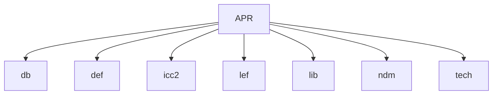
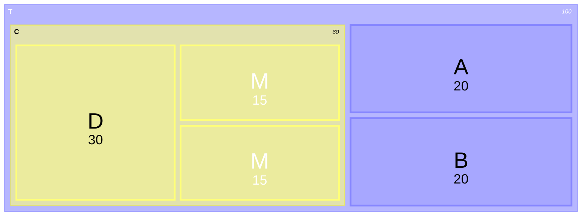
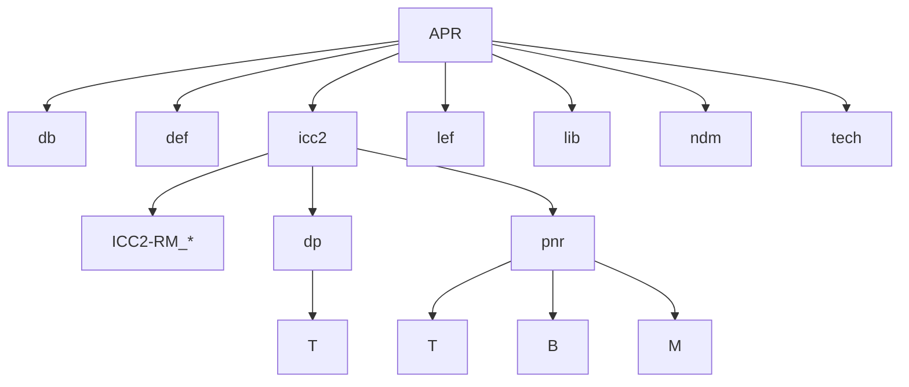
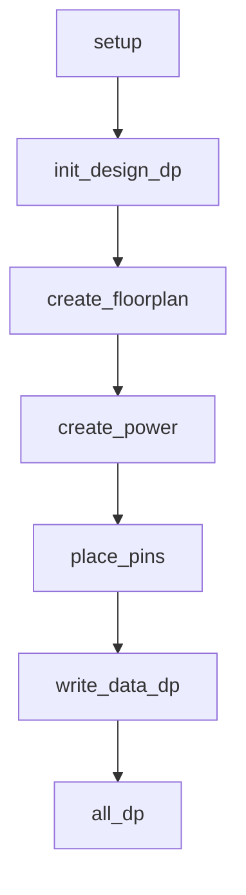
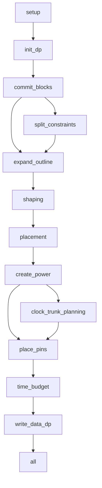
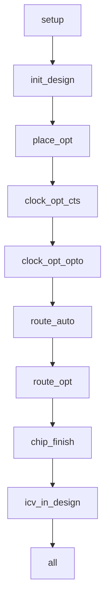

# IC Compiler II Reference Methodology

## 目錄結構設定



Reference Methodology 取得方式，前往 [https://solvnet.synopsys.com/rmgen](https://solvnet.synopsys.com/rmgen) 需有企業驗證帳號方能下載；或者在 icc2 目錄下啟動圖形介面，點選 Help → Generate RM Scripts → I agree to the above Terms and Conditions → I agree → OK 。當前路徑底下輸入 **tar zxvf ICC2-RM_*.tar.gz** 解壓縮。解壓縮完畢後進入資料夾內先建立 design.cfg 檔案，根據需求去調整檔案內容。假設電路邏輯架構如下圖



填入多層名稱就是走 HIER 架構(限定使用 space 或 tab 分層)

FLAT 架構填入：

```text
T
```

HIER 架構填入：

```text
T
    B
    M
```

套娃架構填入：

```text
T
    A
    C
        D
```

設定完 design.cfg 檔案後，執行 **unpack_rm_dir.pl design.cfg APR/icc2** 命令會開始拷貝並建立工作環境，其中 APR/icc2 請替換成實際工作目錄位置。建議先完善所有設定再執行此命令，避免需要重複設定 pnr 底下各個拷貝的檔案。執行完後目錄架構應該如下



完成後到 APR/icc2/ICC2-RM_* 底下。執行 **ln -s ../../tech rm_tech_scripts** 命令建立 rm_tech_scripts 捷徑指到 tech 資料夾。

## rm_setup 資料夾設定

rm_utilities 資料夾內附圖形化設定介面，輸入 **configureRM --sf** 查看支援編輯的檔案列表。輸入 configureRM --in ../rm_setup/design_setup.tcl 可以編輯檔案，需要修改下列檔案

- [Makefile_*](#makefile_)
- [design_setup.tcl](#design_setuptcl)
- [header_icc2_*.tcl](#header_icc2_tcl)
- [icc2_dp_setup.tcl](#icc2_dp_setuptcl)
- [sidefile_setup.tcl](#sidefile_setuptcl)

### Makefile_*

根據啟動環境編輯 Makefile 內容以符合環境設定，使用 **which** 指令查詢全路徑後修改

```text
 ICC2_EXEC = icc2_shell
 FM_EXEC = fm_shell
 VC_LP_EXEC = vc_static_shell

 DESIGN_LIB := $(subst $\",,$(shell expand rm_setup/design_setup.tcl | grep "^set DESIGN_NAME" | awk '{print $$3}'))
```

### design_setup.tcl

| 項目 | 變數 | 數值 | 說明 |
| --- | --- | --- | --- |
| GENERAL | DESIGN_NAME | module_name | unpack_rm_dir.pl 根據 design.cfg 內容自動修改 |
| DESIGN PLANNING SETUP | DESIGN_STYLE | flat | unpack_rm_dir.pl 根據 design.cfg 架構自動修改 |
| DESIGN PLANNING SETUP | PHYSICAL_HIERARCHY_LEVEL | bottom | unpack_rm_dir.pl 根據 design.cfg 架構自動修改 |
| DESIGN PLANNING SETUP | SUB_BLOCK_LIBRARIES | 填寫 block 路徑 | 在 PNR 階段 TOP 需要設定完成的 block 資料夾所在位置 |
| DESIGN PLANNING SETUP | USE_ABSTRACTS_FOR_BLOCKS | 填寫 block 名稱 | 在 PNR 階段 TOP 需要設定完成的 block module_name |
| DESIGN PLANNING SETUP | BLOCK_AABSTRACT_FOR_* | $ICV_IN_DESIGN_BLOCK_NAME abstract | 修改為各步驟階段變數名稱 |
| LIBRARY SETUP | REFERENCE_LIBRARY | *.ndm | 填入NDM 所在位置 STD_NDM 要在最前面 |
| LIBRARY SETUP | TCL_MULTI_VT_CONSTRAINT_FILE | multi_vth_constraint_script.tcl | 編輯 rm_user_plugin_scripts 裡的檔案，修改 HVT SVT LVT 名稱與 LVT % 數 |
| LIBRARY SETUP | TIE_LIB_CELL_PATTERN_LIST | */*TIE* |TIE CELL 名稱 |
| LIBRARY SETUP | HOLD_FIX_LIB_CELL_PATTERN_LIST | */BUF* */INV* */DEL* | 填入修 Hold time 使用的 cell |
| LIBRARY SETUP | CTS_LIB_CELL_PATTERN_LIST | */NBUF* */AOBUF* */AOINV* */SDFF* | 修 CTS 使用，包含repeaters, always-on repeaters, and gates, always-on buffer |
| LIBRARY SETUP | CTS_ONLY_LIB_CELL_PATTERN_LIST | */CKBUF* */CKINV* | 填入長 CTS 使用的 cell |
| TECHNOLOGY | TECH_FILE | tech.tf | technology file |
| TECHNOLOGY | ENABLE_REDUNDANT_VIA_INSERTION | true | clock_opt_opto, route_auto, route_opt 塞 double via |
| TECHNOLOGY | ENABLE_POST_ROUTE_OPT_REDUNDANT_VIA_INSERTION | true | hyper_route_opt 塞 double via |
| TECHNOLOGY | TCL_ANTENNA_RULE_FILE | antenna_rule.tcl | 參考 examples/TCL_ANTENNA_RULE_FILE.txt 核對製程廠給的 antenna 資料內容是否正確 |
| MCMM SCENARIO/MODE/CORNER SETUP |TCL_MCMM_SETUP_FILE | init_design.mcmm_setup.tcl | 複製 examples/TCL_MCMM_SETUP_FILE.*.tcl 至 rm_icc2_pnr_scripts 裡並修改內容 |
| MCMM SCENARIO/MODE/CORNER SETUP |TCL_PARASITIC_SETUP_FILE | init_design.parasitic_setup.tcl | 複製 examples/TCL_PARASITIC_SETUP_FILE.tcl 至 rm_icc2_pnr_scripts 裡並修改內容 |
| MCMM SCENARIO/MODE/CORNER SETUP |PLACE_OPT_ACTIVE_SCENARIO_LIST | SCENARIO 名稱 | 根據 init_design.mcmm_setup.tcl 填入 place_opt 啟用的 SCENARIO 名稱 |
| MCMM SCENARIO/MODE/CORNER SETUP |CLOCK_OPT_CTS_ACTIVE_SCENARIO_LIST | SCENARIO 名稱 | 根據 init_design.mcmm_setup.tcl 填入 clock_opt_cts 啟用的 SCENARIO 名稱 |
| MCMM SCENARIO/MODE/CORNER SETUP |ROUTE_OPT_ACTIVE_SCENARIO_LIST | SCENARIO 名稱 | 根據 init_design.mcmm_setup.tcl 填入 route_opt 啟用的 SCENARIO 名稱 |
| LOGICAL INPUTS | VERILOG_NETLIST_FILES | *.vo | DP 階段 design 給檔案；PNR 階段讀取 DP 結果，設定為 dp/$DESIGN_NAME/outputs_icc2/*write_floorplan/*.v.gz* |
| LOGICAL INPUTS | UPF_FILE | *.upf | DP 階段 design 給檔案；PNR 階段讀取 DP 結果，設定為 dp/$DESIGN_NAME/outputs_icc2/*write_floorplan/*.upf |
| LOGICAL INPUTS | SAIF_FILE_LIST | *.saif | design 給檔案 |
| LOGICAL INPUTS | SAIF_FILE_POWER_SCENARIO | SCENARIO 名稱 | 填入 design 驗證的 SCENARIO 名稱 |
| LOGICAL INPUTS | SAIF_FILE_SOURCE_INSTANCE | 電路驗證架構路徑 | design 給 |
| PHYSICAL INPUTS | TCL_FLOORPLAN_FILE | floorplan.tcl | DP 階段請自行新建 floorplan.tcl；PNR 階段讀取 DP 結果，設定為 dp/$DESIGN_NAME/outputs_icc2/*write_floorplan/floorplan.tcl |
| PHYSICAL INPUTS | DEF_SCAN_FILE | *.def | design 給檔案 |
| PHYSICAL INPUTS | SWITCH_CONNECTIVITY_FILE | switch_connectivity.tcl | 複製 examples/TCL_MV_SETUP_FILE.tcl 至 floorplan 裡並只留下 connect_power_switch 相關指令 |
| USER PLUGIN SCRIPTS| TCL_USER_WRITE_DATA_POST_SCRIPT | write_data_post_script.tcl | 於 rm_user_plugin_scripts 新建檔案，並客製化寫出項目 |

### header_icc2_*.tcl

修改 **set search_path** 加入自訂額外搜尋路徑，例如：./design ./floorplan

```text
set search_path [list ./design ./floorplan ./rm_user_plugin_scripts ./rm_tech_scripts ./rm_icc2_dp_flat_scripts ./rm_icc2_dp_hier_scripts ./rm_icc2_pnr_scripts ./rm_setup ./examples $WORK_DIR]
```

### icc2_dp_setup.tcl

| 項目 | 變數 | 數值 | 說明 |
| --- | --- | --- | --- |
| GENERAL | DP_FLOW | flat | unpack_rm_dir.pl 根據 design.cfg 架構自動修改 |
| GENERAL | TCL_FLOORPLAN_FILE_DP | floorplan.tcl | Design Planning 專用 floorplan 請自行設計 |
| GENERAL | DP_HIGH_CAPACITY_MODE | false | 決定 verilog 讀取模式，設 true 為 outline 模式；設 false 為 design 模式 |
| GENERAL | FLOORPLAN_STYLE | abutted | 管道模式 (channel) 或緊鄰模式 (abutted) |
| GENERAL | DISTRIBUTED | false | 設 true 為分散式運算模式；設 false 為一般主機模式 |
| GENERAL | SUB_BLOCK_REFS | 各 HIER module 名稱 | unpack_rm_dir.pl 根據 design.cfg 架構自動修改 |
| GENERAL | TCL_TIMING_RULER_SETUP_FILE | init_design.parasitic_setup.tcl | 複製 examples/TCL_PARASITIC_SETUP_FILE.tcl 至 rm_icc2_pnr_scripts 裡並修改內容 |
| GENERAL | TCL_SHAPING_CONSTRAINTS_FILE | shaping_constraints.tcl | 設定 vlotage area 和 shaping constraints |
| GENERAL | TCL_AUTO_PLACEMENT_CONSTRAINTS_FILE | auto_placement_constraints.tcl | 設定 keepout_margin 和 macro 擺放方向 |
| GENERAL | CONGESTION_DRIVEN_PLACEMENT | macro | 建議設定 |
| GENERAL | TIMING_DRIVEN_PLACEMENT | std_cell | 建議設定 |
| GENERAL | MACRO_CONSTRAINT_STYLE | edge | 建議設定 |
| GENERAL | TCL_PNS_FILE | pns_strategies.tcl | 設定 power 和 ground 佈線範圍與佈線條件 |
| GENERAL | PNS_CHARACTERIZE_FLOW | false | 設 true 各 block 重複執行 TCL_COMPILE_PG_FILE 內容；設 false 上層 power 和 ground 佈線壓進 block 內 |
| GENERAL | TCL_COMPILE_PG_FILE | compile_pg.tcl | 此處設定無用，被 sidefile_setup.tcl 的 TCL_COMPILE_PG_FILE 設定覆蓋 |
| GENERAL | TCL_PIN_CONSTRAINT_FILE | pins_constraints.tcl | 設定 feedthrough 條件與允許使用的 layer |

### sidefile_setup.tcl

| 項目 | 變數 | 數值 | 說明 |
| --- | --- | --- | --- |
| GENERAL | ROUTING_LAYER_DIRECTION_OFFSET_LIST | {ME1 horizontal} {ME2 vertical} | 修改繞線方向 |
| GENERAL | MIN_ROUTING_LAYER | ME1 | 繞線底層 layer |
| GENERAL | MAX_ROUTING_LAYER  |ME5 | 繞線頂層 layer |
| GENERAL | TCL_USER_CONNECT_PG_NET_SCRIPT | user_connect_pg_net.tcl | 自定義 cell power & ground 連接 |
| GENERAL | TCL_COMPILE_PG_FILE | compile_pg.tcl | 自定義 power & ground 佈線 |
| GENERAL | TCL_LIB_CELL_DONT_USE_FILE | dont_use.tcl | 定義不使用 cell |
| GENERAL | TCL_CTS_NDR_RULE_FILE | [cts_ndr.tcl](#cts_ndrtcl) | 複製 examples/cts_ndr.tcl 至 rm_icc2_pnr_scripts 裡並修改內容 |
| GENERAL | CHIP_FINISH_METAL_FILLER_LIB_CELL_LIST | */FILE64U |填入有電容 FILER 名稱由大到小 |
| GENERAL | CHIP_FINISH_NON_METAL_FILLER_LIB_CELL_LIST | */FIL4U |填入無電容 FILER 名稱由大到小 |
| GENERAL | WRITE_GDS_LAYER_MAP_FILE | streamout.map | 轉 GDS 對 layer 用 |

## rm_icc2_pnr_scripts 資料夾設定

需要建立或修改下列檔案

- [cts_ndr.tcl](#cts_ndrtcl) 複製 examples/cts_ndr.tcl 修改
- [init_design.memm_setup.tcl](#init_designmemm_setuptcl) 複製 examples/TCL_MCMM_SETUP_FILE.auto_expanded.tcl 修改
- [init_design.parasitic_setup.tcl](#init_designparasitic_setuptcl) 複製 examples/TCL_PARASITIC_SETUP_FILE.tcl 修改
- [set_timing_derate.tcl](#set_timing_deratetcl) 自行建立或合併進 init_design.memm_setup.tcl

### cts_ndr.tcl

| 項目 | 變數 | 數值 | 說明 |
| --- | --- | --- | --- |
| GENERAL | CTS_NDR_RULE_NAME | rm_2w2s | 指定 clock root nets 要使用的規則 rm_2w2s、rm_2w2s_shield_default、rm_2w2s_shield_list |
| GENERAL | CTS_NDR_MIN_ROUTING_LAYER | ME3 | 修改繞線最小層數 |
| GENERAL | CTS_NDR_MAX_ROUTING_LAYER | ME5 | 修改繞線最大層數 |

### init_design.memm_setup.tcl

```text
待展開
```

### init_design.parasitic_setup.tcl

```text
待展開
```

### set_timing_derate.tcl

```text
待展開
```

## rm_user_plugin_scripts 資料夾設定

需要建立或修改下列檔案

- auto_placement_constraints.tcl
- compile_pg.tcl
- pin_constraints.tcl
- pns_strategies.tcl
- shaping_constraints.tcl

## Design Planning 流程圖 (FLAT)



## Design Planning 流程圖 (HIER)



## Block-level Implementation 流程圖


