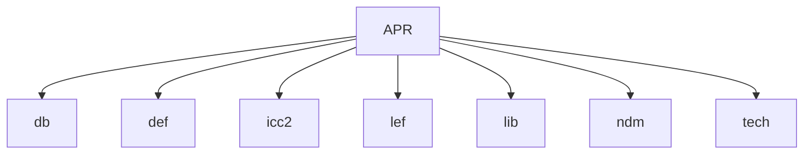
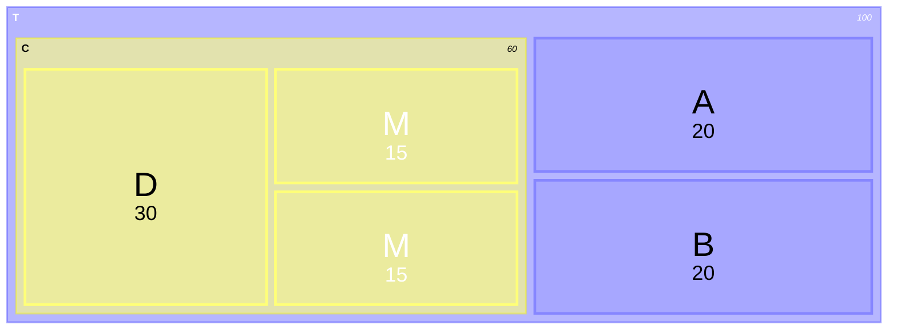
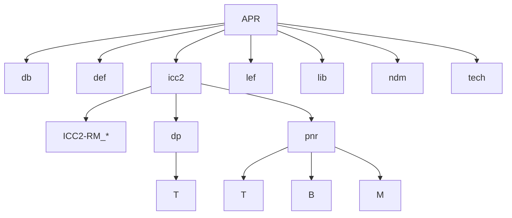
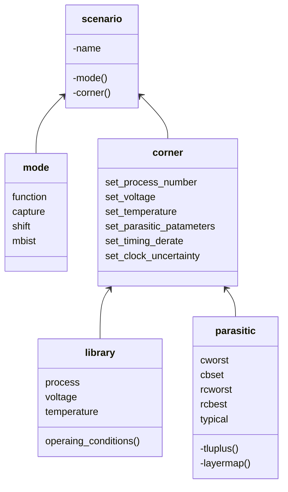
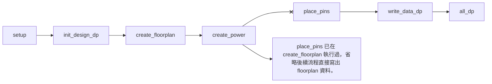

# IC Compiler II Reference Methodology

## 基本設定



 前往 [https://solvnet.synopsys.com/rmgen](https://solvnet.synopsys.com/rmgen) 需有企業驗證帳號方能下載 Reference Methodology；或者在 icc2 目錄下啟動圖形介面，點選 Help → Generate RM Scripts → I agree to the above Terms and Conditions → I agree → OK 。當前路徑底下輸入 **tar zxvf ICC2-RM_*.tar.gz** 解壓縮。解壓縮完畢後進入資料夾內先建立 design.cfg 檔案，根據需求去調整檔案內容。假設電路邏輯架構如下圖



填入多層名稱就是走 HIER 架構(限定使用 space 或 tab 分層)

FLAT 架構填入：

```text
T
```

HIER 架構填入：

```text
T
    B
    M
```

套娃架構填入：

```text
T
    A
    C
        D
```

設定完 design.cfg 檔案後，執行 **unpack_rm_dir.pl design.cfg APR/icc2** 命令會開始拷貝並建立工作環境，其中 APR/icc2 請替換成實際工作目錄位置。建議先完善所有設定再執行此命令，避免需要重複設定 pnr 底下各個拷貝的檔案。執行完後目錄架構應該如下



完成後到 APR/icc2/ICC2-RM_* 底下。執行 **ln -s ../../tech rm_tech_scripts** 命令建立 rm_tech_scripts 捷徑指到 tech 資料夾。

### rm_setup 資料夾設定

rm_utilities 資料夾內附圖形化設定介面，輸入 **configureRM --sf** 查看支援編輯的檔案列表。輸入 configureRM --in ../rm_setup/design_setup.tcl 可以編輯檔案，需要修改下列檔案

- [Makefile_*](#makefile_)
- [design_setup.tcl](#design_setuptcl)
- [header_icc2_*.tcl](#header_icc2_tcl)
- [sidefile_setup.tcl](#sidefile_setuptcl)

#### Makefile_*

根據啟動環境編輯 Makefile 內容以符合環境設定，使用 **which** 指令查詢全路徑後修改

```text
 ICC2_EXEC = icc2_shell
 FM_EXEC = fm_shell
 VC_LP_EXEC = vc_static_shell

 DESIGN_LIB := $(subst $\",,$(shell expand rm_setup/design_setup.tcl | grep "^set DESIGN_NAME" | awk '{print $$3}'))
```

#### design_setup.tcl

| 項目 | 變數 | 數值 | 說明 |
| --- | --- | --- | --- |
| DESIGN PLANNING SETUP | SUB_BLOCK_LIBRARIES | 填寫 block 路徑 | 在 PNR 階段 TOP 需要設定完成的 block 資料夾所在位置 |
| DESIGN PLANNING SETUP | USE_ABSTRACTS_FOR_BLOCKS | 填寫 block 名稱 | 在 PNR 階段 TOP 需要設定完成的 block module_name |
| DESIGN PLANNING SETUP | BLOCK_ABSTRACT_FOR_* | $ICV_IN_DESIGN_BLOCK_NAME abstract | 修改為各步驟階段變數名稱 |
| LIBRARY SETUP | REFERENCE_LIBRARY | *.ndm | 填入NDM 所在位置 STD_NDM 要在最前面 |
| LIBRARY SETUP | TCL_MULTI_VT_CONSTRAINT_FILE | multi_vth_constraint_script.tcl | 編輯 rm_user_plugin_scripts 裡的檔案，修改 HVT SVT LVT 名稱與 LVT % 數 |
| LIBRARY SETUP | TIE_LIB_CELL_PATTERN_LIST | */*TIE* |TIE CELL 名稱 |
| LIBRARY SETUP | HOLD_FIX_LIB_CELL_PATTERN_LIST | */BUF* */INV* */DEL* | 填入修 Hold time 使用的 cell |
| LIBRARY SETUP | CTS_LIB_CELL_PATTERN_LIST | */NBUF* */AOBUF* */AOINV* */SDFF* | 修 CTS 使用，包含repeaters, always-on repeaters, and gates, always-on buffer |
| LIBRARY SETUP | CTS_ONLY_LIB_CELL_PATTERN_LIST | */CKBUF* */CKINV* | 填入長 CTS 使用的 cell |
| TECHNOLOGY | TECH_FILE | tech.tf | technology file |
| TECHNOLOGY | ENABLE_REDUNDANT_VIA_INSERTION | true | clock_opt_opto, route_auto, route_opt 塞 double via |
| TECHNOLOGY | ENABLE_POST_ROUTE_OPT_REDUNDANT_VIA_INSERTION | true | hyper_route_opt 塞 double via |
| TECHNOLOGY | TCL_ANTENNA_RULE_FILE | antenna_rule.tcl | 參考 examples/TCL_ANTENNA_RULE_FILE.txt 核對製程廠給的 antenna 資料內容是否正確 |
| MCMM SCENARIO/MODE/CORNER SETUP |TCL_MCMM_SETUP_FILE | init_design.mcmm_setup.tcl | 複製 examples/TCL_MCMM_SETUP_FILE.*.tcl 至 rm_icc2_pnr_scripts 裡並修改內容 |
| MCMM SCENARIO/MODE/CORNER SETUP |TCL_PARASITIC_SETUP_FILE | init_design.parasitic_setup.tcl | 複製 examples/TCL_PARASITIC_SETUP_FILE.tcl 至 rm_icc2_pnr_scripts 裡並修改內容 |
| MCMM SCENARIO/MODE/CORNER SETUP |PLACE_OPT_ACTIVE_SCENARIO_LIST | SCENARIO 名稱 | 根據 init_design.mcmm_setup.tcl 填入 place_opt 啟用的 SCENARIO 名稱 |
| MCMM SCENARIO/MODE/CORNER SETUP |CLOCK_OPT_CTS_ACTIVE_SCENARIO_LIST | SCENARIO 名稱 | 根據 init_design.mcmm_setup.tcl 填入 clock_opt_cts 啟用的 SCENARIO 名稱 |
| MCMM SCENARIO/MODE/CORNER SETUP |ROUTE_OPT_ACTIVE_SCENARIO_LIST | SCENARIO 名稱 | 根據 init_design.mcmm_setup.tcl 填入 route_opt 啟用的 SCENARIO 名稱 |
| LOGICAL INPUTS | VERILOG_NETLIST_FILES | *.vo | DP 階段 design 給檔案；PNR 階段讀取 DP 結果，設定為 dp/$DESIGN_NAME/outputs_icc2/*write_floorplan/*.v.gz* |
| LOGICAL INPUTS | UPF_FILE | *.upf | DP 階段 design 給檔案；PNR 階段讀取 DP 結果，設定為 dp/$DESIGN_NAME/outputs_icc2/*write_floorplan/*.upf |
| LOGICAL INPUTS | SAIF_FILE_LIST | *.saif | design 給檔案 |
| LOGICAL INPUTS | SAIF_FILE_POWER_SCENARIO | SCENARIO 名稱 | 填入 design 驗證的 SCENARIO 名稱 |
| LOGICAL INPUTS | SAIF_FILE_SOURCE_INSTANCE | 電路驗證架構路徑 | design 給 |
| PHYSICAL INPUTS | TCL_FLOORPLAN_FILE | floorplan.tcl | DP 階段請自行新建 floorplan.tcl；PNR 階段讀取 DP 結果，設定為 dp/$DESIGN_NAME/outputs_icc2/*write_floorplan/floorplan.tcl |
| PHYSICAL INPUTS | DEF_SCAN_FILE | *.def | design 給檔案 |
| PHYSICAL INPUTS | SWITCH_CONNECTIVITY_FILE | switch_connectivity.tcl | 複製 examples/TCL_MV_SETUP_FILE.tcl 至 floorplan 裡並只留下 connect_power_switch 相關指令 |
| USER PLUGIN SCRIPTS| TCL_USER_WRITE_DATA_POST_SCRIPT | write_data_post_script.tcl | 於 rm_user_plugin_scripts 新建檔案，並客製化寫出項目 |

#### header_icc2_*.tcl

修改 **set search_path** 加入自訂額外搜尋路徑，例如：./design ./floorplan

```text
set search_path [list ./design ./floorplan ./rm_user_plugin_scripts ./rm_tech_scripts ./rm_icc2_dp_flat_scripts ./rm_icc2_dp_hier_scripts ./rm_icc2_pnr_scripts ./rm_setup ./examples $WORK_DIR]
```

#### sidefile_setup.tcl

| 項目 | 變數 | 數值 | 說明 |
| --- | --- | --- | --- |
| GENERAL | ROUTING_LAYER_DIRECTION_OFFSET_LIST | {ME1 horizontal} {ME2 vertical} | 修改繞線方向 |
| GENERAL | MIN_ROUTING_LAYER | ME1 | 繞線底層 layer |
| GENERAL | MAX_ROUTING_LAYER  |ME5 | 繞線頂層 layer |
| GENERAL | TCL_USER_CONNECT_PG_NET_SCRIPT | connect_pg_net_script.tcl | 自定 power & ground 連接 |
| GENERAL | TCL_COMPILE_PG_FILE | compile_pg.tcl | 自定 power & ground 佈線 |
| GENERAL | TCL_LIB_CELL_DONT_USE_FILE | dont_use.tcl | 定義不使用 cell |
| GENERAL | TCL_CTS_NDR_RULE_FILE | [cts_ndr.tcl](#cts_ndrtcl) | 複製 examples/cts_ndr.tcl 至 rm_icc2_pnr_scripts 裡並修改內容 |
| GENERAL | CHIP_FINISH_METAL_FILLER_LIB_CELL_LIST | */FILE64U |填入有電容 FILER 名稱由大到小 |
| GENERAL | CHIP_FINISH_NON_METAL_FILLER_LIB_CELL_LIST | */FIL4U |填入無電容 FILER 名稱由大到小 |
| GENERAL | WRITE_GDS_LAYER_MAP_FILE | streamout.map | 轉 GDS 對 layer 用 |

### rm_icc2_pnr_scripts 資料夾設定

需要建立或修改下列檔案

- [cts_ndr.tcl](#cts_ndrtcl) 複製 examples/cts_ndr.tcl 修改
- [init_design.memm_setup.tcl](#init_designmemm_setuptcl) 複製 examples/TCL_MCMM_SETUP_FILE.auto_expanded.tcl 修改
- [init_design.parasitic_setup.tcl](#init_designparasitic_setuptcl) 複製 examples/TCL_PARASITIC_SETUP_FILE.tcl 修改

#### cts_ndr.tcl

| 項目 | 變數 | 數值 | 說明 |
| --- | --- | --- | --- |
| GENERAL | CTS_NDR_RULE_NAME | rm_2w2s | 指定 clock root nets 要使用的規則 rm_2w2s、rm_2w2s_shield_default、rm_2w2s_shield_list |
| GENERAL | CTS_NDR_MIN_ROUTING_LAYER | ME3 | 修改繞線最小層數 |
| GENERAL | CTS_NDR_MAX_ROUTING_LAYER | ME6 | 修改繞線最大層數 |

#### init_design.memm_setup.tcl



```text
set mode_list "function capture shift mbist"
set process_list "1"
set voltage_list "1.08 1.2 1.32"
set temperature_list "-40 25 125"
set rc_corner_list "cworst cbest rcworst rcbest typical"
set analysis_list "setup hold"

foreach mode $mode_list {
  create_mode $mode
}

set corner_list ""
foreach process $process_list {
    foreach voltage $voltage_list {
        foreach temperature $temperature_list {
            foreach rc_corner $rc_corner_list {
                foreach analysis $analysis_list {
                    lappend corner_list "${process}_${voltage}_${temperature}_${rc_corner}_${analysis}"
                    create_corner ${process}_${voltage}_${temperature}_${rc_corner}_${analysis}
                }
            }
        }
    }
}

foreach mode $mode_list {
    foreach corner $corner_list {
        create_scenario -name ${mode}_${corner} -mode $mode -corner $corner
    }
}

foreach_in_collection scenario [get_scenarios - mode function] {
    current_scenario $scenario
    rm_source -file scanned.sdc
}

foreach_in_collection scenario [get_scenarios - mode capture] {
    current_scenario $scenario
    rm_source -file aptg_capture.sdc
}

foreach_in_collection scenario [get_scenarios - mode shift] {
    current_scenario $scenario
    rm_source -file aptg_shift.sdc
}

foreach_in_collection scenario [get_scenarios - mode mbist] {
    current_scenario $scenario
    rm_source -file mbist.sdc
}

foreach_in_collection scenario [all_scenarios] {
    current_scenario $scenario

    set process [lindex [spilt [get_object_name [current_corner]] _] 0]
    set voltage [lindex [spilt [get_object_name [current_corner]] _] 1]
    set temperature [lindex [spilt [get_object_name [current_corner]] _] 2]
    set rc_corner [lindex [spilt [get_object_name [current_corner]] _] 3]
    set analysis [lindex [spilt [get_object_name [current_corner]] _] end]
    
    set_process_number -early $process -late $process

    set_voltage $voltage -min $voltage
    set_voltage $voltage -min $voltage -object_list VDD
    set_voltage 0 -min 0 -object_list VSSD

    set_temperature $temperature -min $temperature

    set_parasitic_parameters -earlt_spec $rc_corner -late_spec $rc_corner -early_temperature $temperature -late_temperature $temperature
    
    if {$voltage == "1.08" && $analysis == "setup"} {
        set_timing_derate -late -clock 1 -cell_delay
        set_timing_derate -late -data 1 -cell_delay
        set_timing_derate -early 0 clock 0.929 -cell_delay
        set_timing_derate -late -clock 1 -net_delay
        set_timing_derate -late -data 1 -net_delay
        set_timing_derate -early 0 clock 0.929 -net_delay
    }

    if {$voltage == "1.08" && $analysis == "hold"} {
        set_timing_derate -early -clock 0.861 -cell_delay
        set_timing_derate -early -data 0.861 -cell_delay
        set_timing_derate -late 0 clock 1 -cell_delay
        set_timing_derate -early -clock 0.861 -net_delay
        set_timing_derate -early -data 0.861 -net_delay
        set_timing_derate -late 0 clock 1 -net_delay
    }
    
    if {$voltage == "1.32" && $analysis == "hold"} {
        set_timing_derate -early -clock 1 -cell_delay
        set_timing_derate -early -data 1 -cell_delay
        set_timing_derate -late 0 clock 1.151 -cell_delay
        set_timing_derate -early -clock 1 -net_delay
        set_timing_derate -early -data 1 -net_delay
        set_timing_derate -late 0 clock 1.151 -net_delay
    }

    set_clock_uncertainty -setup 0.3 [all_clocks]
    set_clock_uncertainty -seholdtup 0.3 [all_clocks]

    if {$analysis == "setup"} {
        set_scenario_status $scenario -none -setup true -hold false -leakage_power true -dynamic_power true -max_transition true -max_capacitance true -min_capacitance false -active true
    }
    if {$analysis == "hold"} {
        set_scenario_status $scenario -none -setup false -hold true -leakage_power true -dynamic_power false -max_transition true -max_capacitance false -min_capacitance true -active true
    }
}
```

#### init_design.parasitic_setup.tcl

```text
set parasitic1 "cworst"
set tluplus_file($parasitic1) "cworst.tlu+"
set layer_map_file($parasitic1) "mapping_gate"

set parasitic2 "cbest"
set tluplus_file($parasitic2) "cbest.tlu+"
set layer_map_file($parasitic2) "mapping_gate"

set parasitic3 "rcworst"
set tluplus_file($parasitic3) "rcworst.tlu+"
set layer_map_file($parasitic3) "mapping_gate"

set parasitic4 "rcbest"
set tluplus_file($parasitic4) "rcbest.tlu+"
set layer_map_file($parasitic4) "mapping_gate"

set parasitic5 "typical"
set tluplus_file($parasitic5) "typical.tlu+"
set layer_map_file($parasitic5) "mapping_gate"

foreach p [array name tluplus_file] {
    read_parasitic_tech -tlup $tluplus_file($p) -layermap $layer_map_file($p) -name $p
}
```

## Design Planning FLAT 流程



### rm_setup 資料夾設定 (FLAT)

- [icc2_dp_setup.tcl](#icc2_dp_setuptcl-flat)
- [sidefile_setup.tcl](#sidefile_setuptcl-flat)

#### icc2_dp_setup.tcl (FLAT)

| 項目 | 變數 | 數值 | 說明 |
| --- | --- | --- | --- |
| GENERAL | INITIALIZE_FLOORPLAN_UTIL |  | 清除內容不使用 util 模式，將使用 BOUNDARY 形式 |
| GENERAL | INITIALIZE_FLOORPLAN_BOUNDARY | {0 0} {x y} | 使用 x y 設定 DIE 大小 |
| GENERAL | INITIALIZE_FLOORPLAN_CORE_OFFSET | 0 0 | 設定為 0 0，使 CORE 可以擺到 DIE 邊緣 |
| GENERAL | TCL_USER_PLACE_PINS_INIT_PRE_SCRIPT | place_pins_init_pre_script.tcl | 修正 port 位置 |
| GENERAL | TCL_PHYSICAL_CONSTRAINTS_FILE | physical_constraints.tcl | 設定 macro placement、blockages、voltage area |
| GENERAL | TCL_MV_SETUP_FILE | init_design.mv_setup.tcl | 複製 examples/TCL_MV_SETUP_FILE.tcl 至 rm_user_plugin_scripts 裡並修改內容 |
| GENERAL | TCL_USER_CREATE_POWER_FLAT_POST_SCRIPT | write_data_dp_flat.tcl | 寫出 floorplan 資訊 |
| GENERAL | TCL_AUTO_PLACEMENT_CONSTRAINTS_FILE | auto_placement_constraints.tcl | 設定 keepout_margin 和 macro 擺放方向 |
| GENERAL | CONGESTION_DRIVEN_PLACEMENT | macro | 建議設定 |
| GENERAL | TIMING_DRIVEN_PLACEMENT | std_cell | 建議設定 |
| GENERAL | TCL_PNS_FILE | pns_strategies.tcl | 自定 power & ground 佈線方式 |
| GENERAL | TCL_COMPILE_PG_FILE |  | 此處設定無用，被 sidefile_setup.tcl 的 TCL_COMPILE_PG_FILE 設定覆蓋 |
| GENERAL | TCL_PIN_CONSTRAINT_FILE | pins_constraints.tcl | 設定 pin 條件與允許使用的 layer |

#### sidefile_setup.tcl (FLAT)

| 項目 | 變數 | 數值 | 說明 |
| --- | --- | --- | --- |
| GENERAL | SIDEFILE_CREATE_FLOORPLAN_FLAT_BOUNDARY_CELLS | boundary_cells.tcl | 設定 bounadry cell 擺放 |
| GENERAL | SIDEFILE_CREATE_FLOORPLAN_FLAT_TAP_CELLS | tap_cells.tcl | 設定 tap cell 擺放 |
| GENERAL | TCL_USER_CONNECT_PG_NET_SCRIPT | connect_pg_net_script.tcl | 自定 power & ground 連接 |
| GENERAL | TCL_COMPILE_PG_FILE | compile_pg.tcl | 自定 power & ground 佈線 |

### rm_user_plugin_scripts 資料夾設定 (FLAT)

需要建立下列檔案

- [auto_placement_constraints.tcl](#auto_placement_constraintstcl)
- [boundary_cells.tcl](#boundary_cellstcl)
- [compile_pg.tcl](#compile_pgtcl)
- [connect_pg_net_script.tcl](#connect_pg_net_scripttcl)
- [init_design.mv_setup.tcl](#init_designmv_setuptcl)
- [physical_constraints.tcl](#physical_constraintstcl)
- [place_pins_init_pre_script.tcll](#place_pins_init_pre_scripttcl)
- [pns_strategies.tcl](#pns_strategiestcl)
- [tap_cells.tcl](#tap_cellstcl)
- [write_data_dp_flat.tcl](#write_data_dp_flattcl)

#### auto_placement_constraints.tcl

```text
set_app_options -name plan.place.continue_on_error -value true
set_app_options -name plan.place.auto_create_blockages -value none
set_app_options -name plan.place.auto_generate_blockages -value false
set_macro_constraints -allowed_orientations {R0 R90 R180 R270 MX MXR90 MY MYR90} [get_cells * -physical_context -filter {is_memory_cell == true}]
```

#### boundary_cells.tcl

```text
#remove_cells [get_cells * -physical_context -filter {ref_name =~ FILLER4}]
set_boundary_cell_rules -left_boundary_cell [get_lib_cells */FILLER4] -right_boundary_cell [get_lib_cells */FILLER4]
compile_boundary_cells
check_boundary_cells
```

#### compile_pg.tcl

```text
compile_pg -strategies ring_strat
compile_pg -strategies {rail_strat_gndk rail_strat_vddk rail_strat_off} -via_rule rail_via_rule
compile_pg -straegies tap_strat_off
compile_pg -strategies {mesh_strat_top mesh_strat_on mesh_strat_off} -via_rule mesh_via_rule

#SW_VDD
create_pg_vias -nets VDDK -from_types stripe -to_types pwrswitch_pin -from_layer ME5 -to_layers ME1 -via_masters {VIA12_1cut_H_3S VIA23_1cut_H_3S VIA34_1cut_H_3S VIA45_1cut_H_3S}
create_pg_vias -nets VDDK -from_types stripe -to_types stripe -from_layer ME5 -to_layers ME2
#RAM
create_pg_vias -nets {VDDK VDDK_SW_OFF GNDK} -from_types stripe -to_types macro_pin -from_layer ME5 -to_layers ME4
```

#### connect_pg_net_script.tcl

```text
#create_port VDDK -direction inout -port_type power
#create_port GNDK -direction inout -port_type ground
#create_net VDDK -power
#create_net GNDK -ground
#connect_pg_net -net VDDK [get_ports VDDK]
#connect_pg_net -net GNDK [get_ports GNDK]
connect_pg_net -net VDDK [get_flat_pins */VDD -all]
connect_pg_net -net GNDK [get_flat_pins */VSS -all]
connect_pg_net -net VDDK [get_flat_pins */VBP -all]
connect_pg_net -net GNDK [get_flat_pins */VBN -all]
```

#### init_design.mv_setup.tcl

```text
create_power_switch_array -power_switch PD_OFF_SW -lib_cell */SW_CELL_NAME -voltage_area PD_OFF -x_pitch 48.72 -x_offset 20 -siterow_pitch 1 -siterow_offset 1

connect_power_switch -source PSW_ON -port_name SW_PORT -mode daisy -direction vertical -voltage_area PD_OFF

associate_mv_cells -power_switches

#connect_pg_net -net VDDK_SW_OFF [get_pins */VDDC -physical_context -filter {power_domain == PD_OFF}]
#connect_pg_net -net VDDK [get_pins */VDDP -physical_context -filter {power_domain == PD_OFF}]
#connect_pg_net -net GNDK [get_pins */VSS -physical_context -filter {power_domain == PD_OFF}]

connect_pg_net -automatic
```

#### physical_constraints.tcl

```text
read_def IO.def
set_fixed_objects [get_cells * -physical_context -filter {is_io == true}]

read_def Analog_Macro.def
set_fixed_objects [get_cells * -physical_context -filter {is_hard_macro == true}]

create_voltage_area -power_domains PD_OFF -is_fixed -region {{0 0} {x y}} -guard_band {{2 2}}

create_voltage_area_rule -name default_rule -allow_pass_through true -allow_buffering true -allow_physical_feedthorugh false -allow_logical_feedthrough false
create_voltage_area_rule -name off_rule -allow_pass_through true -allow_buffering true -allow_physical_feedthorugh true -allow_logical_feedthrough true -voltage_areas PD_OFF

create_keepout_margin -type hard_macro -outer {left bottom right top} [get_cells * -physical_context -filter {is_memory_cell == true}]
create_placement_blockage -type hard_macro -boundary {{0 0}{x y}} -name PM

create_keepout_margin -type hard -tracks_per_macro_pin 0.56 -min_padding_per_macro 2 [get_cells * -physical_context -filter {is_memory_cell == true}]
create_placement_blockage -type hard -boundary {{0 0}{x y}} -name PB
```

#### place_pins_init_pre_script.tcl

```text
set unplaced_ports [get_ports -quiet -filter "port_type!=power && port_type!=ground"]
foreach_in_collection port $unplaced_ports {
    set port_net [get_nets of_objects $port]
    set leaf_pin [get_pins -leaf of_objects $port_net]
    set terminals [get_shapes -of_objects $leaf_pin]
    foreach_in_collection terminal $terminals {
        set pin_shape [get_attribute $terminal boundary]
        set pin_layer [get_object_name [get_attribute $terminal layer]]
        set shape_type [length $pin_shape]
        if {$shape_type == 2} {
            set shape_of_terminal [create_shape -shape_type rect -boundary $pin_shape -layer $pin_layer]
        } else {
            set shape_of_terminal [create_shape -shape_type polygon -boundary $pin_shape -layer $pin_layer]
        }
    }
    crate_terminal -object $shape_of_terminal -port $port
}
remove_shapes [get_shapes -hierarchical -filter undefined(net)]
set_fixed_objects [get_terminals -quiet -filter "physical_status==unrestricted"]
```

#### pns_strategies.tcl

```text
crate_keepout_margin -type routing_blockage -outer {2 2 2 2} -layers {ME1 ME2 ME3 ME4} [get_cells * -physical_context -filter {is_memory_cell == true}]

#remove_routes -ring
#remove_routes -stripe
#remove_routes -macro_pin_connect
#remove_routes -lib_cell_pin_connect

#remove_pg_regions -all
create_pg_region {pg_core} -polygon {{0 0} {x1 y1} {x2 y2} ... {x? y?}}

#remove_pg_patterns -all

create_pg_ring_pattern ring_pat -horizontal_layer {ME1} -horizontal_width {5} -horizontal_spacing {2} -vertical_layer {ME3} -vertical_wodth {5} -vertical_spacing {2}

create_pg_std_cell_conn_pattern rail_pat -layer {ME1 ME2}

create_pg_special_pattern tap_pat -insert_physical_cell_alignment_straps {{lib_cells:TAP}{layer:ME2}{direction:horizontal}{pin_layers:ME2}}

##############################################################################################################
#       VDDK         OFF         GNDK         VDDK         OFF         GNDK         VDDK         OFF         GNDK
#width  1.12        1.12        1.12        1.12        1.12        1.12        1.12        1.12        1.12
#space          7           7           7           7           7           7           7           7
#       pwrsw                                                                   pwrsw
##############################################################################################################
#VDDK to GNDK spacing = 7 + 1.12 + 7 = 15.12
#VDDK to VDDK pitch = 0.56 + 7 + 1.12 + 7 + 1.12 + 7 + 0.56 = 24.36
#pwrse pitch = 0.56 + 7 + 1.12 + 7 + 1.12 + 7 + 1.12 + 7 + 1.12 + 7 + 1.12 + 7 + 0.56 = 48.72
##############################################################################################################
#       VDDK         OFF         GNDK         VDDK         OFF         GNDK         VDDK         OFF         GNDK
#width  5.88        5.88        5.88        5.88        5.88        5.88        5.88        5.88        5.88
#space      2.24        2.24        2.24        2.24        2.24        2.24        2.24        2.24
#       pwrsw                                                                   pwrsw
##############################################################################################################
#VDDK to GNDK spacing = 2.24 + 5.88 + 2.24 = 10.36
#VDDK to VDDK pitch = 2.94 + 2.24 + 5.88 + 2.24 + 5.88 + 2.24 + 2.94 = 24.36
#pwrse pitch = 2.94 + 2.24 + 5.88 + 2.24 + 5.88 + 2.24 + 5.88 + 2.24 + 5.88 + 2.24 + 5.88 + 2.24 + 2.94 = 48.72
##############################################################################################################

create_pg_mesh_pattern mesh_pat -layers { \
    {{vertical_layer:ME5}{width:1.12}{spacing:interleaving}{pitch:24.36}{trim:false}} \
    {{horizontal_layer:ME6}{width:1.12}{spacing:interleaving}{pitch:24.36}{trim:false}} \
    {{vertical_layer:ME7}{width:5.88}{spacing:interleaving}{pitch:24.36}{trim:false}} \
    {{horizontal_layer:AP}{width:5.88}{spacing:interleaving}{pitch:24.36}{trim:false}} \
} -via_rule { \
    {{layer:ME5}{layers:ME6}{via_master:default}} \
    {{layer:ME7}{layers:AP}{via_master:default}} \
    {{intersection: undefined} {via_master: NIL}} \
}

#remove_pg_strategies all
set_pg_strategy ring_strat -pg_regions pg_core -pattern {{name:ring_pat}{nets:VDDK GNDK}}

set_pg_strategy rail_strat_gndk -pg_regions pg_core -pattern {{name:rail_pat}{nets:GNDK}}
set_pg_strategy rail_strat_vddk -voltage_areas DEFAULT_VA -pattern {{name:rail_pat}{nets:VDDK}} -blockage {voltage_areas:PD_OFF}
set_pg_strategy rail_strat_off -voltage_areas PD_OFF -pattern {{name:rail_pat}{nets:VDDK_SW_OFF}}

set_pg_strategy tap_strat_off -voltage_area PD_OFF -pattern {{name:tap_pat}{nets:VDDK}} -blockage {voltage_areas:DEFAULT_VA}

#   VDDK        X               GNDK
set_pg_strategy mesh_strat_top -pg_regions pg_core -pattern {{name:mesh_pat}{nets:{VDDK - GNDK}}}
#   X           VDDK            X
set_pg_strategy mesh_strat_on -pg_regions pg_core -pattern {{name:mesh_pat}{nets:{- VDDK -}}} -blockage {voltage_areas:PD_OFF}
#   X           VDDK_SW_OFF     X
set_pg_strategy mesh_strat_off -voltage_areas PD_OFF -pattern {{name:mesh_pat}{nets:{- VDDK_SW_OFF -}}{offset:{8.12 8.12}}{offset_start:boundary}} -blockage {voltage_areas:DEFAULT_VA}

#remove_pg_strategy_via_rules -all
set_pg_strategy_via_rule rail_via_rule -via_rule {{intersection:all}{via_master:NIL}}

set_pg_strategy_via_rule mesh_via_rule -via_rule { \
    { \
        {{strategies:{mesh_strat_top mesh_strat_on mesh_strat_off}}{layers:ME5}} \
        {{existing:std_conn}{layers:ME2}} \
        {via_master:default} \
    } \
    {{intersection:undefined}{via_master:NIL}} \
}
```

#### tap_cells.tcl

```text
#remove_cells [get_cells * -physical_context -filter {ref_name =~ TAP}]
create_tap_cells -lib_cell [get_lib_cells */TAP] -distance 48.72 -voltage_area PD_OFF -skip_fixed_cells

connect_pg_net -net VDDK [get_pins */VDD -physical_context -filter {power_domain == PD_TOP}]
connect_pg_net -net GNDK [get_pins */VSS -physical_context -filter {power_domain == PD_TOP}]

connect_pg_net -net VDDK_SW_OFF [get_pins */VDD -physical_context -filter {power_domain == PD_OFF}]
connect_pg_net -net VDDK [get_pins */VDDR -physical_context -filter {power_domain == PD_OFF}]
connect_pg_net -net GNDK [get_pins */VSS -physical_context -filter {power_domain == PD_OFF}]
```

#### write_data_dp_flat.tcl

```text
set WRITE_DATA_FROM_BLOCK_NAME ${DESIGN_NAME}
########################################################################
## write_floorplan and write_def
########################################################################
set write_floorplan_cmd_root "write_floorplan \
  -format icc2 \
  -def_version 5.8 \
  -force \
  -read_def_options {-add_def_only_objects {all} -skip_pg_net_connections} \
  -exclude {scan_chains fills pg_metal_fills routing_rules} \
  -net_types {power ground} \
  -include_physical_status {fixed locked}"
set write_floorplan_cmd "$write_floorplan_cmd_root -output ${OUTPUTS_DIR}/${WRITE_DATA_FROM_BLOCK_NAME}_write_floorplan" 
puts "RM-info: running $write_floorplan_cmd"
eval ${write_floorplan_cmd}
```

## Design Planning HIER 流程


### rm_setup 資料夾設定 (HIER)

#### icc2_dp_setup.tcl (HIER)

| 項目 | 變數 | 數值 | 說明 |
| --- | --- | --- | --- |
| GENERAL | INITIALIZE_FLOORPLAN_UTIL |  | 清除內容不使用 util 模式，將使用 BOUNDARY 形式 |
| GENERAL | INITIALIZE_FLOORPLAN_BOUNDARY | {0 0} {x y} | 使用 x y 設定 DIE 大小 |
| GENERAL | INITIALIZE_FLOORPLAN_CORE_OFFSET | 0 0 | 設定為 0 0，使 CORE 可以擺到 DIE 邊緣 |
| GENERAL | DP_HIGH_CAPACITY_MODE | false | 決定 verilog 讀取模式，設 true 為 outline 模式；設 false 為 design 模式 |
| GENERAL | FLOORPLAN_STYLE | abutted | 管道模式 (channel) 或緊鄰模式 (abutted) |
| GENERAL | DISTRIBUTED | false | 設 true 為分散式運算模式；設 false 為一般主機模式 |
| GENERAL | TCL_TIMING_RULER_SETUP_FILE | init_design.parasitic_setup.tcl | 複製 examples/TCL_PARASITIC_SETUP_FILE.tcl 至 rm_icc2_pnr_scripts 裡並修改內容 |
| GENERAL | TCL_PAD_CONSTRAINTS_FILE | pad_constraints.tcl | 設定 pad 位置 |
| GENERAL | TCL_SHAPING_CONSTRAINTS_FILE | shaping_constraints.tcl | 設定 vlotage area 和 shaping constraints |
| GENERAL | TCL_AUTO_PLACEMENT_CONSTRAINTS_FILE | auto_placement_constraints.tcl | 設定 keepout_margin 和 macro 擺放方向 |
| GENERAL | CONGESTION_DRIVEN_PLACEMENT | macro | 建議設定 |
| GENERAL | TIMING_DRIVEN_PLACEMENT | std_cell | 建議設定 |
| GENERAL | MACRO_CONSTRAINT_STYLE | on_edge | 建議設定 |
| GENERAL | TCL_PNS_FILE | pns_strategies.tcl | 設定 power 和 ground 佈線範圍與佈線條件 |
| GENERAL | PNS_CHARACTERIZE_FLOW | false | 設 true 各 block 重複執行 TCL_COMPILE_PG_FILE 內容；設 false 上層 power 和 ground 佈線壓進 block 內 |
| GENERAL | TCL_COMPILE_PG_FILE | compile_pg.tcl | 此處設定無用，被 sidefile_setup.tcl 的 TCL_COMPILE_PG_FILE 設定覆蓋 |
| GENERAL | TCL_PIN_CONSTRAINT_FILE | pins_constraints.tcl | 設定 feedthrough 條件與允許使用的 layer |

### rm_user_plugin_scripts 資料夾設定 (HIER)

需要建立下列檔案

- auto_placement_constraints.tcl
- compile_pg.tcl
- pin_constraints.tcl
- pns_strategies.tcl
- shaping_constraints.tcl

## Block-level Implementation 流程


