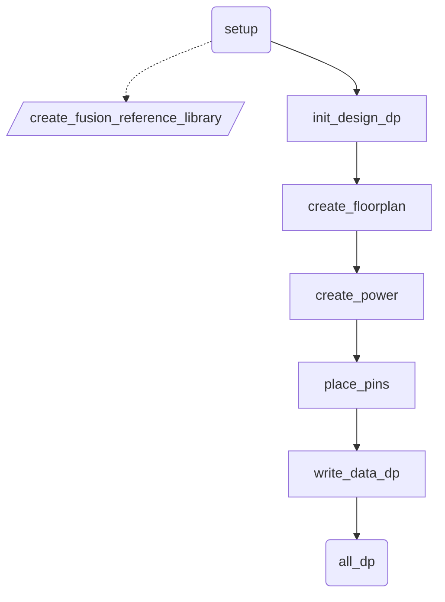
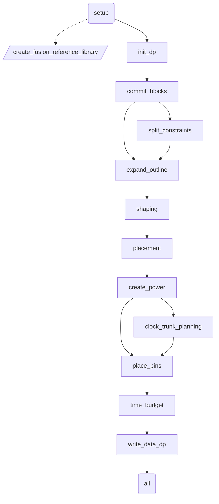
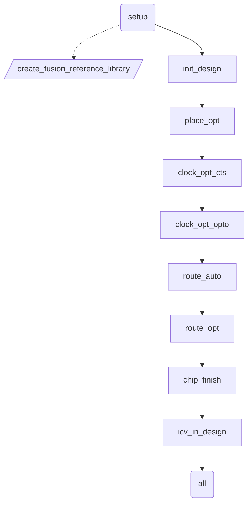

# 如何取得 Reference Methodology
 - 前往 Synopsys SolvNet [Methodology](https://solvnet.synopsys.com/rmgen) 下載，需有驗證帳號方可下載。
 - 或者執行 **icc2_shell -gui** 開啟圖形介面，點選

執行路徑底下會有 ICC2-RM_*.tar.gz，請輸入以下指令解壓縮。

    tar zxvf *.tar.gz

# 如何建立架構
先建立 **design.cfg** 檔案，根據需求去調整檔案內容。

FLAT 架構填入

	TOP_module_name

HIER 架構填入多層名稱，只能使用 TAB 或 SPACE 鍵。

	TOP_module_name
		MID_module_name
			BOT_module_name

設定完 **design.cfg** 檔案後，執行以下命令。其中 **$projdir** 請替換成工作目錄位置。

    unpack_rm_dir.pl design.cfg $projdir

執行完後目錄架構應該如下

	$projdir
		ICC2_RM_*
		dp
			TOP_module_name
		pnr
			TOP_module_name
			MID_module_name
			BOT_module_name

請先切換到 **$projdir/dp/TOP_module_name** 底下。刪除 rm_tech_scrripts 捷徑，建立新捷徑指到 TECH 資料夾。

	rm -rf rm_tech_scripts
	ln -s ../../../tech rm_tech_scripts

# Makefile_* 設定
根據啟動環境編輯 Makefile 內容以符合環境設定

	ICC2_EXEC = icc2_shell_2023
	FM_EXEC = fm_shell_2023
	VC_LP_EXEC = vc_static_shell_2023
	OPTIONS = -f set_options.tcl

新增 **set_options.tcl** 檔案，內容參考

	rm -rf ~/.synopsys_icc2_gui
	set_host_options -max_cores 8
	set_app_options -name shell.common.tmp_dir_path -value /export/home/pdsapr
	gui_create_pref_key -category {layout} -key {layoutToolbarAutoApply} -value_type {bool} -value {true}
   
# rm_setup 資料夾設定
首先切到 **$projdir/dp/TOP_module_name/rm_utilities** 底下，輸入 rm_setup 資料夾底下想設定的檔案

	configureRM --in $projdir/dp/TOP_module_name/rm_setup/design_setup.tcl

需要修改下列檔案

 - [design_setup.tcl](#design_setup.tcl)
 - [icc2_pnr_setup.tcl](#icc2_pnr_setup.tcl)
 - [icc2_dp_setup.tcl](#icc2_dp_setup.tcl)
 - [header_icc2_pnr.tcl](#header_icc2_pnr.tcl)
 - [header_icc2_dp.tcl](#header_icc2_dp.tcl) 
 - [sidefile_setup.tcl](#sidefile_setup.tcl)

# rm_icc2_pnr_scripts 資料夾設定

需要建立下列檔案

 - [init_design.memm_setup.tcl](#init_design.memm_setup.tcl)
 - [init_design.parasitic_setup.tcl](#init_design.parasitic_setup.tcl)

## design_setup.tcl
項目							|變數											|數值								|說明																			|
--------------------------------|-----------------------------------------------|-----------------------------------|-------------------------------------------------------------------------------|
GENERAL							|DESIGN_NAME									|module_name						|unpack_rm_dir.pl 根據 design.cfg 自動填入 module 名稱							|
DESIGN PLANNING SETUP			|DESIGN_STYLE									|flat								|unpack_rm_dir.pl 在 HIER 流程自動修改成 hier									|
DESIGN PLANNING SETUP			|PHYSICAL_HIERARCHY_LEVEL						|									|unpack_rm_dir.pl 在 HIER 流程自動改成 top 、 intermediate 、 bottom			|
LIBRARY SETUP					|REFERENCE_LIBRARY								|*.ndm								|填入NDM 所在位置 STD_NDM 要在最前面											|
LIBRARY SETUP					|TCL_MULTI_VT_CONSTRAINT_FILE					|multi_vth_constraint_script.tcl	|編輯 rm_user_plugin_scripts 裡的檔案，修改 HVT SVT LVT 名稱與 LVT % 數			|
LIBRARY SETUP					|TCL_LIB_CELL_PURPOSE_FILE						|set_lib_cell_purpose.tcl			|編輯 rm_icc2_pnr_scripts 裡的檔案，拷貝 DONT_USE_FILE 多增加 DONT_TOUCH_FILE	|
LIBRARY SETUP					|TIE_LIB_CELL_PATTERN_LIST						|*/*TIE*							|TIE CELL 名稱																	|
LIBRARY SETUP					|HOLD_FIX_LIB_CELL_PATTERN_LIST					|*/BUF* */INV* */DEL*				|填入修 Hold time 使用的 cell													|
LIBRARY SETUP					|CTS_LIB_CELL_PATTERN_LIST						|*/NBUF* */AOBUF* */AOINV* */SDFF*	|修 CTS 使用，包含repeaters, always-on repeaters, and gates, always-on buffer	|
LIBRARY SETUP					|CTS_ONLY_LIB_CELL_PATTERN_LIST					|*/CKBUF* */CKINV*					|填入長 CTS 使用的 cell															|
TECHNOLOGY						|TECH_FILE										|tech.tf							|technology file																|
TECHNOLOGY						|ENABLE_REDUNDANT_VIA_INSERTION					|true								|clock_opt_opto, route_auto, route_opt 塞 double via							|
TECHNOLOGY						|ENABLE_POST_ROUTE_OPT_REDUNDANT_VIA_INSERTION	|true								|hyper_route_opt 塞 double via													|
TECHNOLOGY						|TCL_ANTENNA_RULE_FILE							|antenna_rule.tcl					|參考 examples/TCL_ANTENNA_RULE_FILE.txt										|
MCMM SCENARIO/MODE/CORNER SETUP	|TCL_MCMM_SETUP_FILE							|init_design.memm_setup.tcl			|參考 examples/TCL_MCMM_SETUP_FILE.*.tcl										|
MCMM SCENARIO/MODE/CORNER SETUP	|TCL_PARASITIC_SETUP_FILE						|init_design.parasitic_setup.tcl	|參考 examples/TCL_PARASITIC_SETUP_FILE.tcl										|
MCMM SCENARIO/MODE/CORNER SETUP	|PLACE_OPT_ACTIVE_SCENARIO_LIST					|SCENARIO 名稱						|填入 place_opt 啟用的 SCENARIO 名稱											|
MCMM SCENARIO/MODE/CORNER SETUP	|CLOCK_OPT_CTS_ACTIVE_SCENARIO_LIST				|SCENARIO 名稱						|填入 clock_opt_cts 啟用的 SCENARIO 名稱										|
MCMM SCENARIO/MODE/CORNER SETUP	|ROUTE_OPT_ACTIVE_SCENARIO_LIST					|SCENARIO 名稱						|填入 route_opt 啟用的 SCENARIO 名稱											|
LOGICAL INPUTS					|VERILOG_NETLIST_FILES							|design/*.vo						|design 給的																	|
LOGICAL INPUTS					|UPF_FILE										|design/*.upf						|design 給的																	|
PHYSICAL INPUTS					|TCL_FLOORPLAN_FILE								|floorplan/floorplan.tcl			|Block-level Implementation 專用 floorplan										|
PHYSICAL INPUTS					|DEF_SCAN_FILE									|design/*.def						|design 給的																	|

## sidefile_setup.tcl
項目	|變數										|數值								|說明								|
--------|-------------------------------------------|-----------------------------------|-----------------------------------|
GENERAL	|ROUTING_LAYER_DIRECTION_OFFSET_LIST		|{ME1 horizontal} {ME2 vertical}	|修改繞線方向						|
GENERAL	|MIN_ROUTING_LAYER							|ME1								|繞線底層 layer						|
GENERAL	|MAX_ROUTING_LAYER							|ME5								|繞線頂層 layer						|
GENERAL	|TCL_USER_CONNECT_PG_NET_SCRIPT				|user_connect_pg_net.tcl			|自定義 cell power & ground 連接	|
GENERAL	|TCL_COMPILE_PG_FILE						|compile_pg.tcl						|自定義	power & ground 佈線			|
GENERAL	|TCL_LIB_CELL_DONT_USE_FILE					|design/dont_use.tcl				|定義不使用 cell					|
GENERAL	|TCL_LIB_CELL_DONT_TOUCH_FILE				|design/dont_touch.tcl				|design 專用						|
GENERAL	|TCL_CTS_NDR_RULE_FILE						|cts_ndr.tcl						|參考 examples/cts_ndr.tcl			|
GENERAL	|CHIP_FINISH_METAL_FILLER_LIB_CELL_LIST		|*/FILE64U */FILE32U */FILE16U		|填入有電容 FILER 名稱由大到小		|
GENERAL	|CHIP_FINISH_NON_METAL_FILLER_LIB_CELL_LIST	|*/FIL4U */FIL2U */FIL1U			|填入一般 FILER 名稱由大到小		|
GENERAL	|WRITE_GDS_LAYER_MAP_FILE					|streamout.map						|轉 GDS	對 layer 用					|

cts_ndr.tcl 修改

	CTS_NDR_RULE_NAME "rm_2w2s"
	CTS_NDR_MIN_ROUTING_LAYER "ME3"
	CTS_NDR_MAX_ROUTING_LAYER "ME5"

## icc2_dp_setup.tcl
項目	|變數									|數值							|說明											|
--------|---------------------------------------|-------------------------------|-----------------------------------------------|
GENERAL	|DP_FLOW								|flat							|unpack_rm_dir.pl 在 HIER 流程自動修改成 hier	|
GENERAL	|TCL_FLOORPLAN_FILE_DP					|floorplan/floorplan.tcl		|Design Planning 專用 floorplan	請自行設計		|
GENERAL	|DP_HIGH_CAPACITY_MODE					|false							|決定 verilog 讀取使用 design / outline 模式	|
GENERAL	|FLOORPLAN_STYLE						|abutted						|管道模式 (channel) 或緊鄰模式 (abutted)		|
GENERAL	|DISTRIBUTED							|false							|個別 block 不同程序執行						|
GENERAL	|SUB_BLOCK_REFS							|各 HIER module 名稱			|unpack_rm_dir.pl 在 HIER 流程自動修改			|
GENERAL	|TCL_TIMING_RULER_SETUP_FILE			|init_design.parasitic_setup.tcl|設定 tlu+										|
GENERAL	|TCL_USER_INIT_DP_PRE_SCRIPT			|init_dp_pre_script.tcl			|設定 plan.outline.dense_module_depth -1		|
GENERAL	|TCL_SHAPING_CONSTRAINTS_FILE			|shaping_constraints.tcl		|設定 vlotage area 和 shaping constraints		|
GENERAL	|TCL_AUTO_PLACEMENT_CONSTRAINTS_FILE	|auto_placement_constraints.tcl	|設定 keepout_margin 和 macro 擺放方向			|
GENERAL	|CONGESTION_DRIVEN_PLACEMENT			|macro							|建議設定										|
GENERAL	|TIMING_DRIVEN_PLACEMENT				|std_cell						|建議設定										|
GENERAL	|MACRO_CONSTRAINT_STYLE					|edge							|建議設定										|
GENERAL	|TCL_PNS_FILE							|pns_strategies.tcl				|設定 power 和 ground 佈線範圍與佈線條件		|
GENERAL	|PNS_CHARACTERIZE_FLOW					|true							|各 block 重複執行 pns_strategies 內容			|
GENERAL	|PNS_CHARACTERIZE_FLOW					|false							|由上層 power 和 ground 佈線推下 block 內		|
GENERAL	|TCL_COMPILE_PG_FILE					|compile_pg.tcl					|此處設定無用，被 sidefile_setup.tcl 覆蓋		|
GENERAL	|TCL_PIN_CONSTRAINT_FILE				|pins_constraints.tcl			|設定 feedthrough 條件與允許使用的 layer		|

# Design Planning 流程圖 (FLAT)

# Design Planning 流程圖 (HIER)

# Block-level Implementation 流程圖

